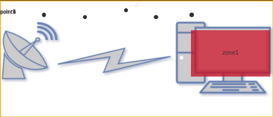
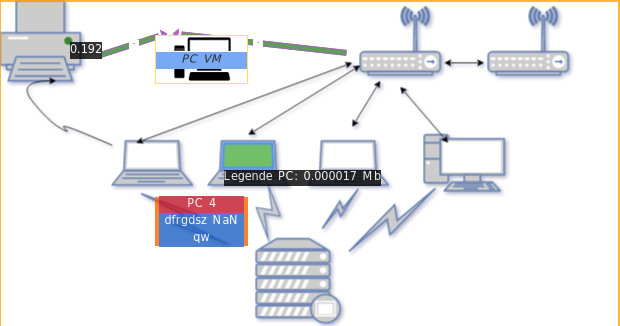

The `dashboard` directory offers different examples for the WeatcherMap plugin of grafana.

## Settings

the above demos were made with an associated server. The configuration of this one is explained on the dedicated page : [settings server](../docs/annex/server.md)

  
  
## Demo1

The associated files you can import are ;

  - Picture background SVG => file *demo1-background.svg*        
  - Displays a selected region => file *demo1-coordRegion.json*      
  - Adds links => file *demo1-Links.json*            
  - Adds points => file *demo1-Point.json*            

## Demo2

The associated files you can import are =>

  - Picture background SVG => file *demo2-background.svg*        
  - Displays a selected element SVG => file *demo2-coordRegion.json*      
  - Adds links => file *demo2-Links.json*            
  - Adds points => file *demo2-Point.json*            
  - Settings demo2 => file *demo2-total.json*

  
    
## Demo3

The associated files you can import are =>

  - Picture background SVG => file *demo3-background.svg*        
  - Displays a selected element SVG and selected region => file *demo3-coordRegion.json*     
  - Adds points => file *demo3-Point.json*            
  - Adds links => file *demo3-Links.json*            

  
  
## Demo4

  
## Demo5

The associated files you can import are =>

  - Picture background SVG => file *demo5-background.svg*        
  - query : rate(go_memstats_alloc_bytes[5m])
  - Displays a selected element SVG and selected region => file *demo5-coordRegion.json*     
  - Adds points => file *demo5-Point.json*  
  - Adds links => file *demo5-Links.json* 
  

  
## Demo6

The associated files you can import are =>

  - Picture background SVG => file *demo6-background.svg*        
  - Displays a selected element SVG and selected region => file *demo6-region-svg.json*     
  - Adds points => file *demo6-point.json*  
  - Adds links => file *demo6-links.json* 
  - query A : rate(node_network_transmit_bytes{device="enp0s3"}[10s])*8/1024/1024
  - query B : rate(node_network_receive_bytes{device="enp0s3"}[10s])*8/1024/1024
  
