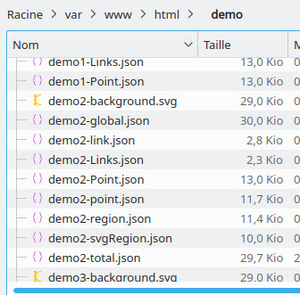

# Settings server

[](README.md)

The import of files by links is done by an associated server.

If you do not perform the operation, you will not be able to take advantage of the functionality because you will get the error message [CORS](https://en.wikipedia.org/wiki/Cross-origin_resource_sharing)

The resolution is done with an associated server either by installing [Apache](https://www.apache.org/)

# Apache 2

You need to have Apache 2.4.x installed first.

## Enable CORS header on apache2

The configuration file must be modified as follows

From the terminal:

```
sudo nano /etc/apache2/apache2.conf
```

change:

```
    <Directory /var/www/>
	    Options Indexes FollowSymLinks
	    AllowOverride None
	    Require all granted
    </Directory>
```

to:

```
    <Directory /var/www/>
	    Options Indexes FollowSymLinks
	    AllowOverride None
	    Require all granted
	    Header set Access-Control-Allow-Origin "*"
    </Directory>
```

After saving, you load the header and restart the service:

```
$ sudo a2enmod headers

$ sudo systemctl restart apache2

```

You place the _resource_ files in the folder

```
/var/www/html

```

# Result

to get the following result


