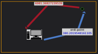
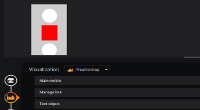
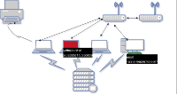
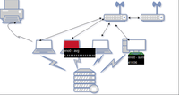
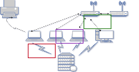
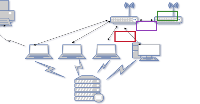

# Demo / Tutorial
 

 
In the form of a **demo**, you will learn how to use the plugin to get a dynamic dashboard

- 1 [Add a dashboard SVG](tutorial01.md)

    

- 2 [Add a dashboard PNG/JPEG](tutorial02.md)

    
    
- 3 [Create dashboard Avanced with link directionnel](tutorial03.md)

    

- 4 [How to create and add your own SVG image in Grafana](tutorial04.md)

    

- 5 [Create a customizable query](tutorial05.md)

    

- 6 [Create modelisation advanced](tutorial06.md)

    

- 7 [Create bi directionnel](tutorial07.md)

    

- 8 [How to use auxiliere metric](tutorial08.md)

    

- 9 [How to create a coordinate mode region](tutorial09.md)

    

- 10 [How to add a global json file ](tutorial10.md)

    

- 11 [How to use initial viewing space](tutorial11.md)

    

