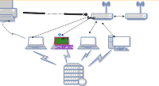
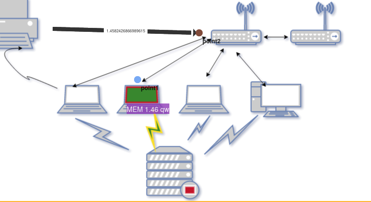
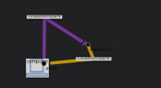
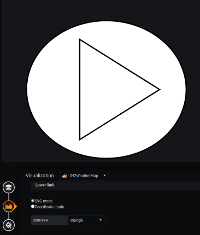

 # Demo / Tutorial

 
In the form of a **demo**, you will learn how to use the plugin to get a dynamic dashboard

- 1 [Add a dashboard SVG](tutorial1.md)

    

- 2 [Add a dashboard PNG/JPEG](tutorial2.md)

    
    
- 3 [Create dashboard Avanced with link directionnel](tutorial3.md)

    

- 4 [How to create and add your own SVG image in Grafana](tutorial4.md)

    

- 5 [Create a customizable query](tutorial5.md)

    

- 6 [Create modelisation advanced](tutorial6.md)

    

- 7 [Create bi directionnel](tutorial7.md)

    

- 8 [How to use auxiliere metric](tutorial8.md)

    

 

