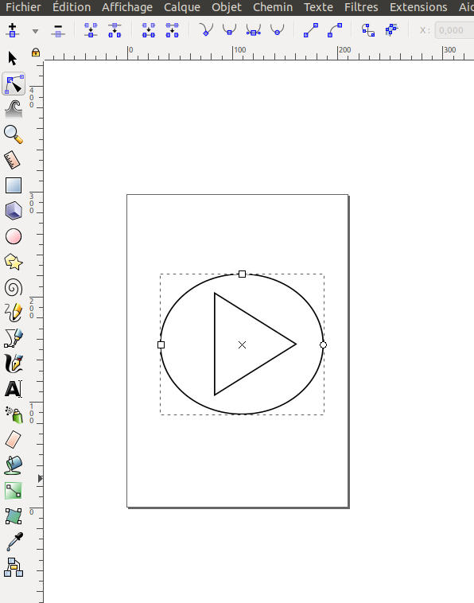
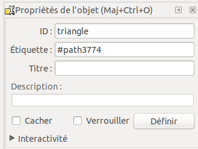

# How to create and add your own SVG image in Grafana

 
## Create you SVG on Inkscape

### Step 1 : Download Inkscape

The recommended software to make a background image will be [Inkscape](https://inkscape.org). It is available for :

  - Linux
  - Windows
  - Mac

### Step 2 : Create your shape

Inkscape allows you to choose between several shapes to create your SVG :

  - Circle
  - Square
  - Other...

You can also create you SVG image with draw.io. More information [here](./appendix/svg.md)

### Step 3 : Add id to all of your objects

It is necessary to add an id to all of your objects. It will be easier to use with Grafana.

To add an id, `right click` on your object, then go on `Properties of your object`. A window will appears and will allow you to change the ID

### Step 4 : Save you shape

To save your shape, you need to save in `SVG Inkscape` or `SVG simple` format.

## Add your SVG in Grafana

Adding a background image is done from the `display` menu.

The selected image will be the one you just created. To do this, we download it in base64 with the `Copy image address` function.

It is possible to have more details with the [display](../editor/display.md) page.

Then, if you want to add a region, from the menu `Coordinates space`, `region` and `Add region`. You can see the different id of your shape in `Zone SVG`. 

