refaire capture ecran

# Create link bi directionnel

[](README.md)

## Add a dashboard SVG


Adding a background image is done from the `display` menu.

The selected image will be [demo7-background.svg](../../resource/demo07-background.svg).

To do this, we download it in base64 with the `Copy image address` function, or with the direct link to the repository:

```
https://raw.githubusercontent.com/atosorigin/grafana-weathermap-panel/master/docs/resource/demo07-background.svg
```

It is possible to have more details with the [display](../editor/display.md) page.

## Create Routeur et ProxyServer regions

### Step 1: Define an SVG region


The creation of a region in an SVG image is done from the `Coordinates space`, `region`, and `Add coordinate space` menu.

You have to fill out the form like this:

- Enter a `label` for example routeur
- Select `SVG label`.
- Choose the `routeur` line from the drop-down list.
- Click on the `save` button

Repeat the same instruction for ProxyServer and Select `Proxy` for the zone SVG

### Step 2: Add color to the SVG element

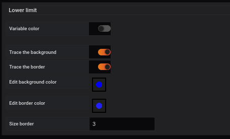

Adding a color to an SVG element is done from the `Coordinates space`, `region`, and `Edit coordinate space` menu.

You select the `Lower limit` line and then complete the form like this:

- Enable `Trace the background` to activate the background color.
- Select the `blue` color in the `Edit background color` line.
- Enable `Trace the border` to activate the border color.
- Select the `blue` color different in the `Edit border color` line.
- Enter a value to set the size of the border `size border` for example 3

You get the following result

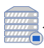

Repeat the same things for the Routeur et choose the color red

It is possible to define other parameters, referring to the [coordinates lower limit](../editor/coordinates-lower-limit.md) page.

## Add bi directional link between two points

### Step 1 : Add the be directional link

First, you have to click twice on `Add Oriented Link` and then, click on the Routeur point and on the ProxyServer Point.

A link will appear and we will edit it to change it to Bidirectional point.

The option of direction is done from the `Coordinates space`, `OrientedLink` menu. Then, click on your link and go down.

Then, select `Bidirectional` for the orientation

You associate the line with the region `AssociateRegionIn` and `AssociateRegionOut`

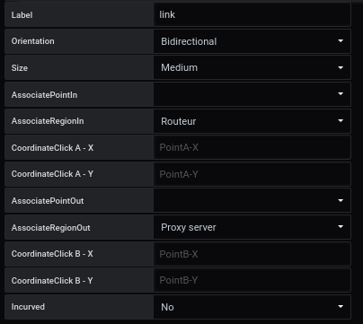

### Step 2 : Choose the color of your link

To change the color, go to the `lower limit` menu.

### Étape 2 : Choisissez la couleur de votre lien

To change the color, go to the `lower limit` menu.

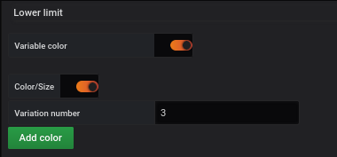

- Variable color check mark
- Number of colour slices for example 3

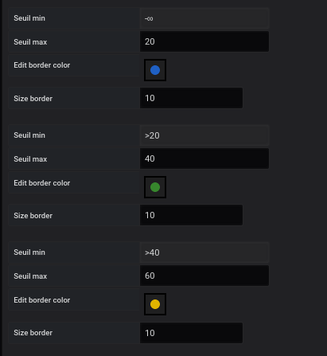

You choose slices and color

- <20 - BLue
- 20 à 40 - Green
- 40 à 60 - Yellow
- 60 à 80 - Orange
- 80< Red

### Step 3 : Add a query to your link

First you will have to create the query.
To do that, go to `Queries` and fill the input like follow :
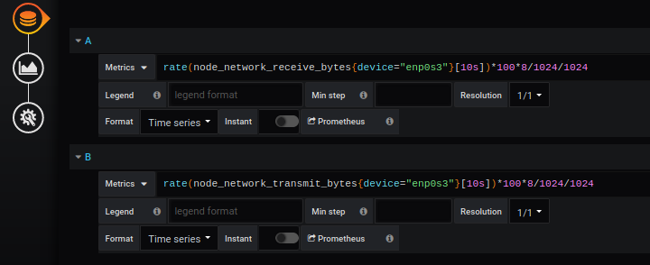

```
Metric A :

rate(nnode_network_receive_bytes_total{device="ens3"}[10s])*100*8/1024/1024


Metric B :

rate(node_network_transmit_bytes_total{device="ens3"}[10s])*100*8/1024/1024
```

Then, you will be able to assign the metrics to your Link A and your Link B

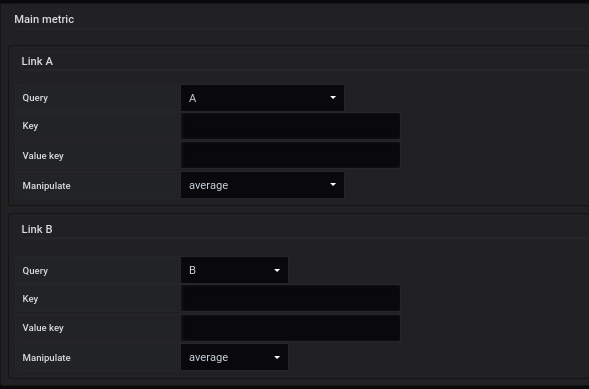

## Add a clickable link

### Step 1 : Add a region with Coordinate Mode

The creation of a region in a coordinate mode is done from the `Coordinates space`, `region`, and `Add coordinate space` menu.

You have to fill out the form like this:

- Enter a `label` for example Computer
- Select `coordinate mode`.
- Fill the coordinate of your region

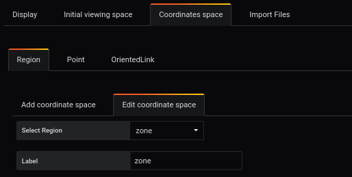
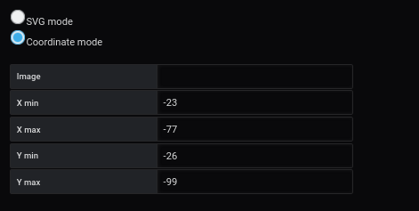

### Step 2 : Add a link

In this same region, it is possible to add a clickable link.
Do to that, go to Manage link and fill the form like follow :

- `Following link` : Allows a redirection towards the link by clicking on the region or on the point.
- `Link tooltip` : Allows a redirection to the link filled in the tool type by clicking on the link.
- `Text in tooltip` : Displays the link in the tooltip that appears when the cursor is passed over the area or point.

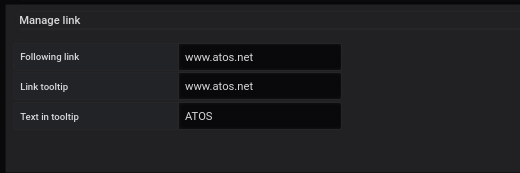

Then you can this on this picture that the link is clickable

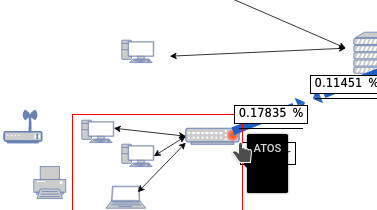

## Result


## Import JSON file

- It is possible to add all of those configurations through JSON files by doing an import. To know how to do it, [follow this link](../editor/import.md)

And here is the different JSON file :

- [demo7-Region SVG](../../resource/demo07-region-svg.json)
- [demo7-Region Coord](../../resource/demo07-region-coord.json)
- [demo7-link](../../resource/demo07-link.json)
