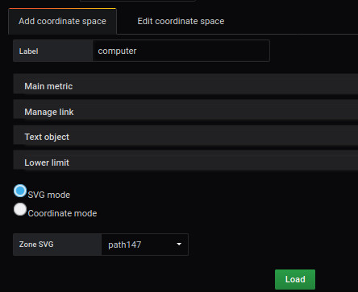
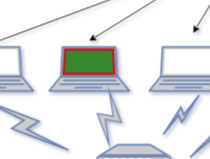
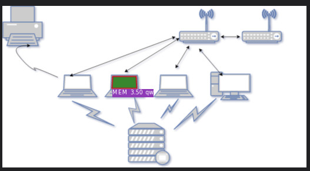

## Création d'un région dynamique


### Etape 1 : Ajouter une image en arrière plan


L'ajout d'une image en arrière plan s'effectue à partir du menu `display`.

L'image sélectionnée sera [demo2-background.svg](https://github.com/atosorigin/grafana-weathermap-panel/blob/master/demo/demo2-background.svg). Pour cela, nous la téléchargeons en base64 avec la  fonction `Copier l'adresse de l'image`

Il est possible d'avoir plus de détails avec la page [display](../EN/editor/display.md)

Il faut sauvergarder et recharger la page.


### Etape 2 : Définir une région SVG





La création d'une région dans dans une image SVG s'effectue à partir du menu `Coordinates space`, `region` et `Àdd coordinate space`

Vous devez remplir le formulaire comme ceci : 

- Saisir un `label` par exemple Computer
- Sélectionner `SVG label`
- Choisir dans la liste déroulante, la ligne `path 147`
- Cliquer sur le bouton `load`


### Etape 3 : Ajouter une couleur à l'élément SVG


L'ajout d'une couleur à un élément SVG s'effectue à partir du menu `Coordinates space`, `region` et `Edit coordinate space`

Vous sélectionnez la ligne `Lower limit` pour compléter le formulaire comme ceci : 
 

- Activer `Trace the background` pour activer la couleur d'arrière plan 
- Sélectionner la couleur `vert` à la ligne `Edit background color`
- Activer `Trace the border` pour activer la couleur de bordure
- Sélectionner la couleur `rouge` à la ligne `Edit border color`
- Saisir une valeur pour définir la taille de la bordure `size border` par exemple 3
- Cliquer sur le bouton `load`


Vous obtenez le résultat suivant




Il est possible de définir d'autres paramètres, en vous référant à la page [coordinates lower limit](../editor/coordinates-lower-limit.md)


### Etape 4 : Ajouter une Query à un élément SVG


La première étape passe par l'onglet `Queries`

Vous devez :

- compléter la ligne `métrics` avec la ligne suivante

```
rate(go_memstats_gc_cpu_fraction[5m]) * 100000
```

Le point de repère sera `A` qui sera le code utilisé ci-dessous

Les paramétrages complémentaires sont disponible à la page ......


La deuxième étape s'effectue à partir du menu `Coordinates space`, `region` et `Edit coordinate space` de l'onglet `visualization`

Vous sélectionnez la ligne `Main metric` pour compléter le formulaire comme ceci : 

- Saisir un `Query` par exemple A
- Cliquer sur le bouton `load`


La valeur sera automatiquement affichée après le rafraichissement de la page


Il est possible de compléter les autres champs avec les paramétrages complémentaires disponible à la page ....


### Etape 5 : Mise en forme des informations de l'élément SVG


La mise en forme des informations de l'élément SVG s'effectue à partir du menu `Coordinates space`, `region` et `Edit coordinate space`

Vous sélectionnez la ligne `Text object` pour compléter le formulaire `Generate text object`comme ceci : 

- Saisir une `légende`
- Saisir le nombre de chiffre après la virgule dans `Digital formating` par exemple 2
- Saisir une unité de mesure à la ligne `unit of mesure` comme qw
- Choisir une couleur d'arrière plan
- Choisir une couleur de texte
- Cliquer sur le bouton `load`

### Résultat

Le résultat final sera comme cela : 




## Création d'un point 

TODO

## Création d'un Lien orienté

TODO
