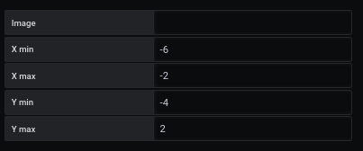
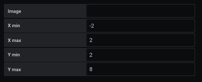
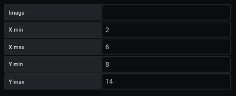
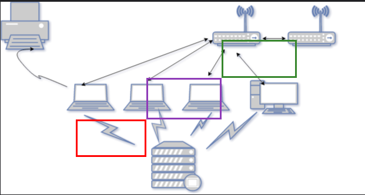

# How to change initial viewing space

Initial viewing space allows you to choose the part of the dashboard you want to work on.

For this demonstration 11, we will take the result of the [tutorial 09](tutorial09.md)

We modify the graduation of the rendering. For that, we modify `initial viewing space` with the new values.

The representation is recalculated with the new limitations. The objects will be automatically recalculated to get new values like this :

`Region 1`

`Region 2`

`Region 3`

the new result will be

