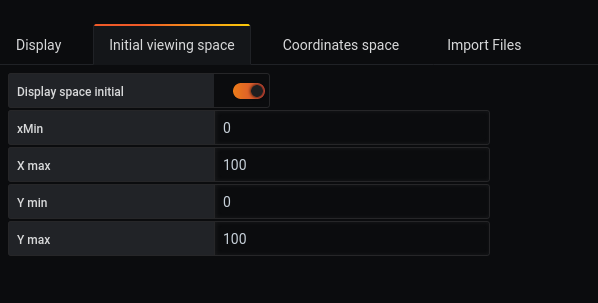
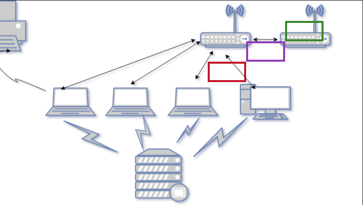

# How to use initial viewing space

Initial viewing space allows you to choose the part of the dashboard you want to work on.

For this demonstration 11, we will take the result of the [tutorial9](tutorial9.md)

And we will modify the `initial viewing space` to work only on the upper right part of the dashboard

To do that :
 - Change xMin from -100 to 0
 - Change Ymin from -100 to 0

Then, you will see that the initial space will move and you will be able to work only on the upper right part of the dashboard.

