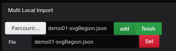
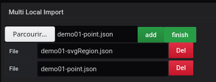
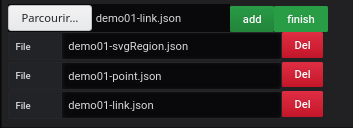
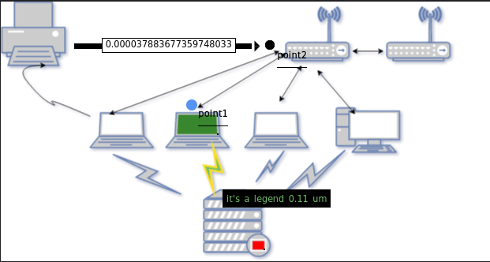

# Building your dashboard from your computer

[](README.md)

In demo 12, we offer you the possibility to create a dashboard without having a server.

## Adding a Query


The first step is through the `Queries` tab.

You must:

- Complete the line `metrics` with the following line

```
rate(go_memstats_gc_cpu_fraction[5m])
```

The `A` marker will be used to identify this query

## Add background image


Adding a background image can be done from the menu `display`.

We choose the file selector to choose the selected image will be [demo01-background.svg](../../resource/demo01-background.svg).

## Import files

To import the different json from your computer, the selection is made from the `import files` menu and the `multi local import` area.

### Import Region file



To import a json Region file, you can use the file selector to choose the [demo01-svgRegion.json](../../resource/demo01-svgRegion.json).

After confirmation, you click the `add` button, followed by `finish`.

The rendering will be displayed automatically with the loaded file.

### Import point file



To import a json Region file, you can use the file selector to choose the [demo01-point.json](../../resource/demo01-point.json).

After confirmation, you click the `add` button, followed by `finish`.

The rendering will be displayed automatically with the loaded file.

### Import link file



To import a json Region file, you can use the file selector to choose the [demo01-link.json](../../resource/demo01-link.json).

After confirmation, you click the `add` button, followed by `finish`.

The rendering will be displayed automatically with the loaded file.

## Result

The result is as follows


