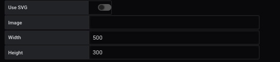

# template simple

[](README.md)

## Add the queries

The example shows how to use query filters to obtain precise metrics


In a query, we want to analyze what the network card receives

Query refID A

```
node_network_name_assign_type

```

The result shows several possible outcomes

```
node_network_name_assign_type{device="ens3",instance="localhost:9100",job="node_exporter"}

```

and the Query Ref B

```
node_network_mtu_bytes
```

The result shows several possible outcomes

```
node_network_mtu_bytes{device="ens3",instance="localhost:9100",job="node_exporter"}
node_network_mtu_bytes{device="lo",instance="localhost:9100",job="node_exporter"}

```

The elements that interest us are:

- device

which will be used in the json template file in the list **filtered**

## Step 2: Determining a space



The creation of a background space is done from the `display' menu.

It requires

- Uncheck `use svg`
- Enter the width
- Enter height

It is possible to have more details with the [display](../editor/display.md) page.

## tab Gabarit

Dans l'onglet **Gabarit**


vous ajoutez le lien du fichier json

```
https://raw.githubusercontent.com/atosorigin/grafana-weathermap-panel/master/docs/resource/demo13-point.json

```

puis 1 clic que le bouton **Add** suivi de **finish**

```
https://raw.githubusercontent.com/atosorigin/grafana-weathermap-panel/master/docs/resource/demo13-poînt-link.json

```

puis 1 clic que le bouton **Add** suivi de **finish**

le lien s'affichera dans la deuxième partie de l'écran


il faut lui attribuer une query pour

- A pour le premier fichier
- B pour le deuxieme fichier

puis 1 clic **load** par ligne

## Resultat


Vous verrez un point apparaitre et l'esemble des réglages disponible dans l'éditeur
