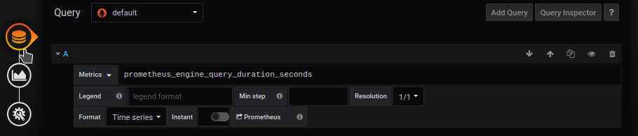

# construire un dashboard par les Query
[](README.md)


**demo en cours de construction**


## Add a query

The example shows how to use query filters to obtain precise metrics





In a query, we want to analyze what the network card receives


```
prometheus_engine_query_duration_seconds
```


The result shows several possible outcomes

```
prometheus_engine_query_duration_seconds{instance="localhost:9090",job="prometheus",quantile="0.5",slice="inner_eval"}
prometheus_engine_query_duration_seconds{instance="localhost:9090",job="prometheus",quantile="0.5",slice="prepare_time"}
prometheus_engine_query_duration_seconds{instance="localhost:9090",job="prometheus",quantile="0.5",slice="queue_time"}
prometheus_engine_query_duration_seconds{instance="localhost:9090",job="prometheus",quantile="0.5",slice="result_sort"}
prometheus_engine_query_duration_seconds{instance="localhost:9090",job="prometheus",quantile="0.9",slice="inner_eval"}
prometheus_engine_query_duration_seconds{instance="localhost:9090",job="prometheus",quantile="0.9",slice="prepare_time"}
prometheus_engine_query_duration_seconds{instance="localhost:9090",job="prometheus",quantile="0.9",slice="queue_time"}
prometheus_engine_query_duration_seconds{instance="localhost:9090",job="prometheus",quantile="0.9",slice="result_sort"}
prometheus_engine_query_duration_seconds{instance="localhost:9090",job="prometheus",quantile="0.99",slice="inner_eval"}
prometheus_engine_query_duration_seconds{instance="localhost:9090",job="prometheus",quantile="0.99",slice="prepare_time"}
prometheus_engine_query_duration_seconds{instance="localhost:9090",job="prometheus",quantile="0.99",slice="queue_time"}
prometheus_engine_query_duration_seconds{instance="localhost:9090",job="prometheus",quantile="0.99",slice="result_sort"}

```

Les elements qui nous interressent sont : 

- instance
- job
- quantile
- slice

qui seront utilisés dans le fichier json de gabarit dans la liste **filtered**


## Determining a space


The creation of a background space is done from the `display' menu.

It requires 

- Uncheck `use svg`
- Enter the width
- Enter height


## tab Gabarit

Dans l'onglet **Gabarit**


vous ajoutez le lien du fichier json 

```
https://raw.githubusercontent.com/atosorigin/grafana-weathermap-panel/master/docs/resource/demo13-gabarit.json

```

puis 1 clic que le bouton **Add** suivi de **finish**


le lien s'affichera dans la deuxième partie de l'écran


il faut lui attribuer une query

puis 1 clic **load
**

Àttention : Actuellement, si plusieurs clic **load** sont fait, ils seront automatiquement ajoutés


## Resultat


Vous verrez un point apparaitre et l'esemble des réglages disponible dans l'éditeur

Actuellement, la valeur de la query, n'est pas affiché


