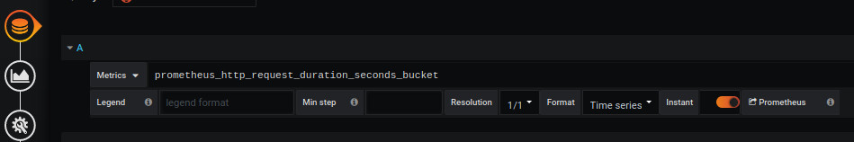
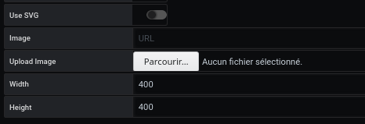
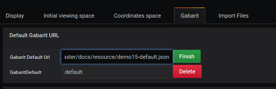
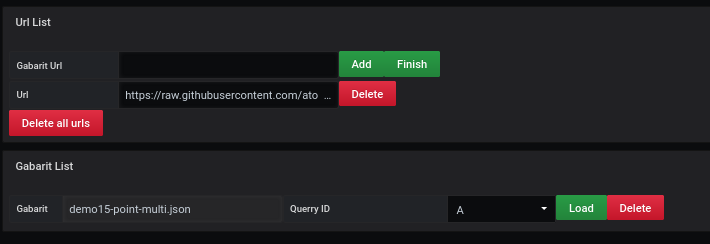

# Multiple gabarit loading

[](README.md)

Demo 15 will position a variable element in an X and Y space, and display its value at the point defined by the query.

## Add a query

The example shows how to use query filters to obtain precise metrics



In a query, we want to analyze what the network card receives

```
prometheus_http_request_duration_seconds_bucket
```

The result shows several possible outcomes

```
prometheus_http_request_duration_seconds_bucket{handler="/api/v1/label/:name/values",instance="localhost:9090",job="prometheus",le="+Inf"}
prometheus_http_request_duration_seconds_bucket{handler="/api/v1/label/:name/values",instance="localhost:9090",job="prometheus",le="0.1"}
prometheus_http_request_duration_seconds_bucket{handler="/api/v1/label/:name/values",instance="localhost:9090",job="prometheus",le="0.2"}
prometheus_http_request_duration_seconds_bucket{handler="/api/v1/label/:name/values",instance="localhost:9090",job="prometheus",le="0.4"}
prometheus_http_request_duration_seconds_bucket{handler="/api/v1/label/:name/values",instance="localhost:9090",job="prometheus",le="1"}
prometheus_http_request_duration_seconds_bucket{handler="/api/v1/label/:name/values",instance="localhost:9090",job="prometheus",le="120"}
prometheus_http_request_duration_seconds_bucket{handler="/api/v1/label/:name/values",instance="localhost:9090",job="prometheus",le="20"}
prometheus_http_request_duration_seconds_bucket{handler="/api/v1/label/:name/values",instance="localhost:9090",job="prometheus",le="3"}
prometheus_http_request_duration_seconds_bucket{handler="/api/v1/label/:name/values",instance="localhost:9090",job="prometheus",le="60"}
prometheus_http_request_duration_seconds_bucket{handler="/api/v1/label/:name/values",instance="localhost:9090",job="prometheus",le="8"}
...
```

Les elements qui nous interressent sont :

- handler
- instance
- job
- le

qui seront utilisés dans le fichier json de gabarit dans la liste **filtered**

## Determining a space



The creation of a background space is done from the `display' menu.

It requires

- Uncheck `use svg`
- Enter the width (ex : 400)
- Enter height (ex : 400)

It is possible to have more details with the [display](../editor/display.md) page.

## Advanced gabarit

Dans l'onglet **Gabarit**



vous ajoutez le fichier par défaut

```
https://raw.githubusercontent.com/atosorigin/grafana-weathermap-panel/master/docs/resource/demo15-default.json

```


vous ajoutez le lien du fichier json

```
https://raw.githubusercontent.com/atosorigin/grafana-weathermap-panel/master/docs/resource/demo15-point-multi.json

```

puis 1 clic que le bouton **Add** suivi de **finish**

le lien s'affichera dans la deuxième partie de l'écran



il faut lui attribuer une query

puis 1 clic **load**

## Resultat


## Structure gabarit files

### default gabarit : demo15-default.json

```
{
  "global": {
     // global
  },
  "default": {
    "templates": [
      {
        // Point
      },
      {
        // Link
      },
      {
        // Region
      }
    ]
  }
}

```

### Template gabarit : demo15-point-multi.json

```
{
  "global": {
    // global
  },
  "default": {
    "templates": [
      {
        // Point
      }
    ]
  },
  "templates": [
      {
        // Point
      }
   ]
}

```

# See too

- [Gabarit default](../appendix/gabarit-default.md)
- [Gabarit template](../appendix/gabarit-template.md)
