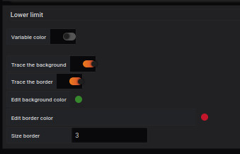
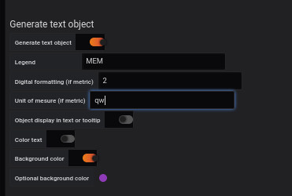
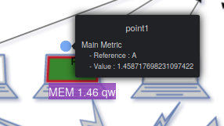
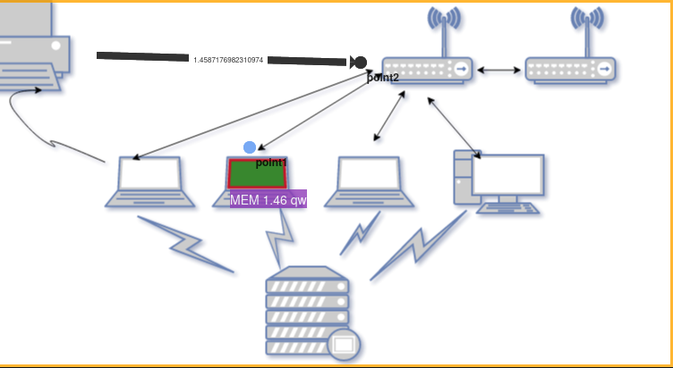

## Add a dashboard SVG


Adding a background image is done from the `display` menu.

The selected image will be [demo2-background.svg](../../resource/demo2-background.svg). To do this, we download it in base64 with the `Copy image address` function.

It is possible to have more details with the [display](../editor/display.md) page.

You have to save and reload the page.


## Creating a dynamic region


### Step 1: Define an SVG region


The creation of a region in an SVG image is done from the `Coordinates space`, `region` and `Add coordinate space` menu.

You have to fill out the form like this: 

- Enter a `label` for example Computer
- Select `SVG label`.
- Choose the `path 147` line from the drop-down list.
- Click on the `load` button


### Step 2: Add a color to the SVG element





Adding a color to a SVG element is done from the `Coordinates space`, `region` and `Edit coordinate space` menu.

You select the `Lower limit' line and then complete the form like this: 
 

- Enable `Trace the background` to activate the background color. 
- Select the `green` color in the `Edit background color` line.
- Enable `Trace the border` to activate the border color.
- Select the `red` color in the `Edit border color` line.
- Enter a value to set the size of the border `size border` for example 3
- Click on the "load" button


You get the following result


It is possible to define other parameters, referring to the [coordinates lower limit](../editor/coordinates-lower-limit.md) page.


### Step 3: Adding a Query to an SVG element


The first step is through the `Queries` tab.

You must:

- Complete the line `metrics` with the following line

```
rate(go_memstats_gc_cpu_fraction[5m]) * 100000
```

The "A" marker will be used to identify this query as you can see below.


The second step is from the `Coordinates space`, `region` and `Edit coordinate space` menu of the `visualization` tab.

You select the `Main metric` line to complete the form like this: 

- Enter a `Query` for example A
- Click on the `load` button


The value will be automatically displayed after the page is refreshed.


It is possible to fill in the other fields with the additional settings available on the page [coordinates space region](../editor/coordinates-space-region.md)


### Step 4: Formatting SVG element information





The formatting of the SVG element information is done from the `Coordinates space`, `Region` and `Edit coordinate space` menu.

You select the `Text object` line to complete the `Generate text object` form like this: 


- Enter a `legend`.
- Enter the number of digits after the decimal point in `Digital formating` e.g. 2
- Enter a unit of measurement in the line `unit of measurement` like qw
- Choose a background color
- Choose a text color
- Click on the "load" button

### Résultat

The end result will be like this: 


## Création d'un point 

### Etape 1 : Placer un point


- Pour placer un point, il faut se rendre dans `Visualization`, puis `Coordinates space`, `Point` et `Add coordinate space`.


Vous devez remplir le formulaire comme ceci : 

- Renseigner le `label` du point
- Renseigner sa `size`
- Saisir la position X et Y ou vous voulez voir le point apparaitre


### Step 2: Add a color to the point


Adding a color to a SVG element is done from the `Coordinates space`, `point` and `Edit coordinate space` menu.

You select the `Lower limit' line and then complete the form like this: 
 

- Enable `Trace the background` to activate the background color. 
- Select the `green` color in the `Edit background color` line.
- Enable `Trace the border` to activate the border color.
- Select the `red` color in the `Edit border color` line.
- Enter a value to set the size of the border `size border` for example 3
- Click on the "load" button


You get the following result


It is possible to define other parameters, referring to the [coordinates lower limit](../editor/coordinates-lower-limit.md) page.


### Step 3: Adding a Query to a point


As seen in the previous section, we need a metric. So you can use the same metric as before, or you can give another metric B

Once you have done that, you will associated this query to your point


The second step is from the `Coordinates space`, `region` and `Edit coordinate space` menu of the `visualization` tab.

You select the `Main metric` line to complete the form like this: 

- Enter a `Query` for example A
- Click on the `load` button


The value will be automatically displayed after the page is refreshed.


It is possible to fill in the other fields with the additional settings available on the page [coordinates space region](../editor/coordinates-space-region.md)


### Résultat

The end result will be like this: 



## Création d'un lien orienté


### Etape 1 : Placer un lien orienté

To create an oriented link you have to pass by [the panel menu](../panel/panel-oriented-link.md).

### Step 2: Adding a Query to a link

Once you have place you link on the image you can go to `Coordinates space` and `point` menu of the `visualization` tab.


Here, you can see your link `OrientedLink 1`

You select the `Main metric` line to complete the form like this: 

- Enter a `Query` for example A
- Click on the `load` button


The value will be automatically displayed after the page is refreshed.


It is possible to fill in the other fields with the additional settings available on the page [coordinates space link](../editor/coordinates-space-link.md)

### Result



## Add everything with JSON

### Import JSON file

- It is possible to add all of those configuration through json files by doing an import. To know how to do it, [follow this link](../editor/import.md)

And here is the different JSON file :
- [demo2-svgRegion](../../resource/demo2-svgRegion.json) 
- [demo2-point](../../resource/demo2-point.json)
- [demo2-link](../../resource/demo2-link.json)
- [demo2-global](../../resource/demo2-global.json)


