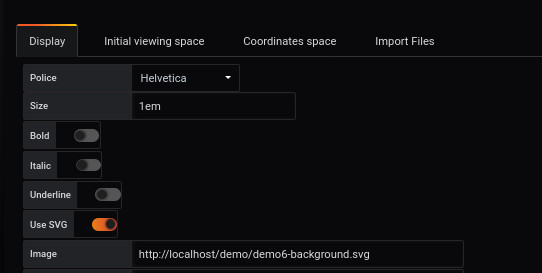

# Create Dashboard import JSON file


- background : demo6-background.svg

Import file

- [region](demo6-region-svg.json)
- [point](demo6-point.json)
- [link](demo6-link.json)

faire une relation entre query et OrientedLink


## Etape 1 : Création des queries


Nous complétons les formulaires pour obtenir 2 requêtes.

La premère requette permet de connaitre les données reçues par la carte réseau

```
rate(node_network_receive_bytes{device="enp0s3"}[10s])*8/1024/1024
```

La deuxième requette permet de connaitre les données envoyées par la carte réseau

```
rate(node_network_transmit_bytes{device="enp0s3"}[10s])*8/1024/1024

```

## Etape 2 : Un serveur de stockage


[Installation du serveur](../appendix/server.md)


## Etape 3 : création d'une image d'arrière plan





L'ajout d'une image en arrière plan s'effectue à partir du menu `display`.

L'image sélectionnée sera [demo6-background.svg](https://github.com/atosorigin/grafana-weathermap-panel/blob/master/demo/demo6-background.svg). Pour cela, nous la téléchargeons en base64 avec la  fonction `Copier l'adresse de l'image`


```
http://localhost/demo/demo6-background.svg

```


Il est possible d'avoir plus de détails avec la page [display](../EN/editor/display.md)


## Etape 3 : Importation des fichiers


L'importation des fichiers s'effectue à partir du menu `Import files`


```

http://localhost/demo/demo6-region-svg.json

http://localhost/demo/demo6-point.json

http://localhost/demo/demo6-link.json

```


