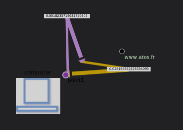

# Create Dashboard Avanced with link  directionnel

## Etape 1 : Création des queries

rate(node_network_receive_bytes{device="enp0s3"}[10s])*8/1024/1024

rate(node_network_transmit_bytes{device="enp0s3"}[10s])*8/1024/1024

## Etape 2 : Déterminer un espace

La création d'un espace en arrière plan s'effectue à partir du menu `display`.

Nous saisissons 

- Décochons `use svg`
- largeur
- hauteur

## Etape 3 : Ajout d'un point 1

La création d'un point s'effectue à partir du menu `Coordinates space`, `point` et `Àdd point`

Vous devez remplir le formulaire comme ceci : 

- Saisir un `label` par exemple Computer
- La taille `size`
- position `X`
- position `Y`
- Cliquer sur le bouton `load`

Nous en profitons der changer la couleur de notre point. Pour cela, nous ajoutons une couleur à notre point comme ceci : 

- Activer `trace the color`
- Choisissons la couleur comme `verte` à la ligne `edit border color`
- L'épaisseur à 1

## Etape 4 : Ajout d'un point 2

- clic sur la barre
- Clic dans l'espace 

Nous en profitons der changer la couleur de notre point. Pour cela, nous ajoutons une couleur à notre point comme ceci : 

- Activer `trace the color`
- Choisissons la couleur comme `bleu` à la ligne `edit border color`
- L'épaisseur à 1

- Cliquer sur le bouton `load`

nous ajoutons des couleurs visibles pour le texte du point 2

## Etape 5 : Ajouter une illustration au point 1

Nous ajoutons une illustration à notre point

image SVG

## Etape 5 ; ajouter lien oriented

TODO

## Etape 6 : main metric

associe query et oriented link

## Resultat

### Import JSON file

TODO

### Import JSON file

- It is possible to add all of those configuration through json files by doing an import. To know how to do it, [follow this link](../editor/import.md)

And here is the different JSON file :
- [demo3-svgRegion](../../resource/demo3-region.json) 
- [demo3-point](../../resource/demo3-point.json)
- [demo3-link](../../resource/demo3-link.json)

