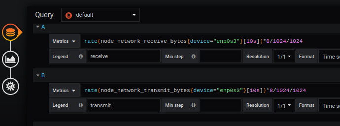
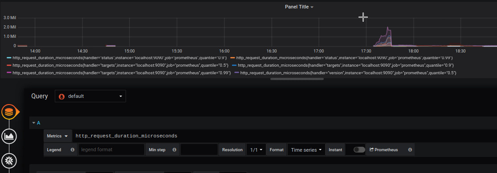
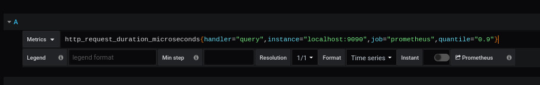

 
# create file modelisation


prometheus_http_request_duration_seconds_bucket{handler="/"}





Dans une query, nous voulons analyser ce que reçoit la carte réseau


```
node_network_receive_bytes

```


le résultat montre plusieurs résultats possibles


```
node_network_receive_bytes{device="enp0s3",instance="localhost:9100",job="node_exporter"}

node_network_receive_bytes{device="lo",instance="localhost:9100",job="node_exporter"}

```

La différence montre 2 types de devices 

- enp0s3
- lo


Il faut associer 1 metrics par region ou points...

comme ceci


Region 1


Region 2


Le resultat affiche 2 valeurs


*-*-*-*-*-*-*-*-*-*-*-*-*-*-*-*-*-*-*-*-*-*-*-*-*-*-*-*-*-*-*-*-*-*-*-*-*-*-*-*-*-*-


# essai 2





http_request_duration_microseconds

Nous obtenons de nombreux résultats 


```
http_request_duration_microseconds{handler="alertmanagers",instance="localhost:9090",job="prometheus",quantile="0.5"}
http_request_duration_microseconds{handler="alertmanagers",instance="localhost:9090",job="prometheus",quantile="0.9"}
http_request_duration_microseconds{handler="alertmanagers",instance="localhost:9090",job="prometheus",quantile="0.99"}
http_request_duration_microseconds{handler="alerts",instance="localhost:9090",job="prometheus",quantile="0.5"}
http_request_duration_microseconds{handler="alerts",instance="localhost:9090",job="prometheus",quantile="0.9"}
http_request_duration_microseconds{handler="alerts",instance="localhost:9090",job="prometheus",quantile="0.99"}
http_request_duration_microseconds{handler="config",instance="localhost:9090",job="prometheus",quantile="0.5"}
http_request_duration_microseconds{handler="config",instance="localhost:9090",job="prometheus",quantile="0.9"}
http_request_duration_microseconds{handler="config",instance="localhost:9090",job="prometheus",quantile="0.99"}
http_request_duration_microseconds{handler="flags",instance="localhost:9090",job="prometheus",quantile="0.5"}
http_request_duration_microseconds{handler="flags",instance="localhost:9090",job="prometheus",quantile="0.9"}
http_request_duration_microseconds{handler="flags",instance="localhost:9090",job="prometheus",quantile="0.99"}
http_request_duration_microseconds{handler="graph",instance="localhost:9090",job="prometheus",quantile="0.5"}
http_request_duration_microseconds{handler="graph",instance="localhost:9090",job="prometheus",quantile="0.9"}
http_request_duration_microseconds{handler="graph",instance="localhost:9090",job="prometheus",quantile="0.99"}
http_request_duration_microseconds{handler="heap",instance="localhost:9090",job="prometheus",quantile="0.5"}
http_request_duration_microseconds{handler="heap",instance="localhost:9090",job="prometheus",quantile="0.9"}
http_request_duration_microseconds{handler="heap",instance="localhost:9090",job="prometheus",quantile="0.99"}
http_request_duration_microseconds{handler="label_values",instance="localhost:9090",job="prometheus",quantile="0.5"}
http_request_duration_microseconds{handler="label_values",instance="localhost:9090",job="prometheus",quantile="0.9"}
http_request_duration_microseconds{handler="label_values",instance="localhost:9090",job="prometheus",quantile="0.99"}
http_request_duration_microseconds{handler="options",instance="localhost:9090",job="prometheus",quantile="0.5"}
http_request_duration_microseconds{handler="options",instance="localhost:9090",job="prometheus",quantile="0.9"}
http_request_duration_microseconds{handler="options",instance="localhost:9090",job="prometheus",quantile="0.99"}
http_request_duration_microseconds{handler="prometheus",instance="localhost:9090",job="prometheus",quantile="0.5"}
http_request_duration_microseconds{handler="prometheus",instance="localhost:9090",job="prometheus",quantile="0.9"}
http_request_duration_microseconds{handler="prometheus",instance="localhost:9090",job="prometheus",quantile="0.99"}
http_request_duration_microseconds{handler="query",instance="localhost:9090",job="prometheus",quantile="0.5"}
http_request_duration_microseconds{handler="query",instance="localhost:9090",job="prometheus",quantile="0.9"}
http_request_duration_microseconds{handler="query",instance="localhost:9090",job="prometheus",quantile="0.99"}

```





nous sélections une query 


l'élément handler sera utilisé comme argument variable 


