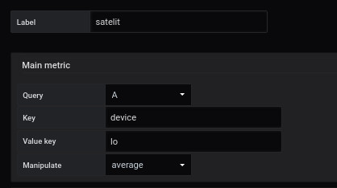

 
# create file modelisation

The example shows how to use query filters to obtain precise metrics


In a query, we want to analyze what the network card receives


```
node_network_receive_bytes

```


The result shows several possible outcomes


```
node_network_receive_bytes{device="enp0s3",instance="localhost:9100",job="node_exporter"}

node_network_receive_bytes{device="lo",instance="localhost:9100",job="node_exporter"}

```

The difference shows 2 types of devices 

- enp0s3
- lo


Il faut associer 1 metrics par region ou points...

comme ceci


Region 1


Region 2




Le resultat affiche 2 valeurs


