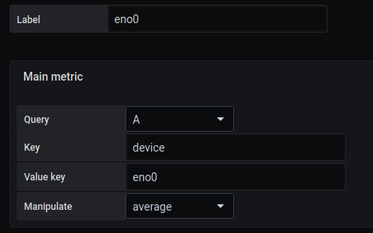
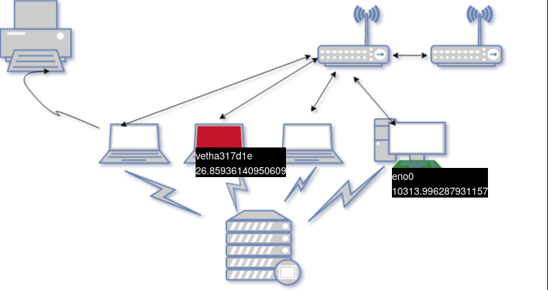

 
# Create a customizable query
[](README.md)
 
## Add a query

The example shows how to use query filters to obtain precise metrics


In a query, we want to analyze what the network card receives


```
rate(node_network_receive_bytes_total[5m])

```


The result shows several possible outcomes


```
node_network_receive_bytes_total{device="br-565444d7f7ec",instance="localhost:9100",job="node"}

node_network_receive_bytes_total{device="br-d1bef2b848cd",instance="localhost:9100",job="node"}

node_network_receive_bytes_total{device="br-f19a1cf1980f",instance="localhost:9100",job="node"}

node_network_receive_bytes_total{device="docker0",instance="localhost:9100",job="node"}

node_network_receive_bytes_total{device="eno0",instance="localhost:9100",job="node"}

node_network_receive_bytes_total{device="veth17769f7",instance="localhost:9100",job="node"}

node_network_receive_bytes_total{device="vetha317d1e",instance="localhost:9100",job="node"}

node_network_receive_bytes_total{device="vethc04149a",instance="localhost:9100",job="node"}

node_network_receive_bytes_total{device="vethdee87cd",instance="localhost:9100",job="node"}

```

The difference shows 9 types of devices. Let's choose 2 for these examples

- vetha317d1e
- eno0


Here we want to filter the result to display only the device we are interested in.


## Create regions and filter the Metric

### Step 1 : Import our file SVG

Adding a background image is done from the `display` menu.

The selected image will be [demo5-background.svg](../../resource/demo5-background.svg). To do this, we download it in base64 with the `Copy image address` function.

It is possible to have more details with the [display](../editor/display.md) page.


```
https://raw.githubusercontent.com/atosorigin/grafana-weathermap-panel/master/docs/resource/demo1-background.svg

```

You have to save and reload the page.

### Step 2 : Create the region

We will create two regions

For this step, you can follow the [tutorial2](tutorial2.md) to create your region and add some colors

### Step 3 : Add Main metric to the region and filter

Once you have created your regions, you can edit them in `Region`, `Edit coordinate space`. Then click on `Main metric` and fill it like this :
- `Query` : Choose the query you are interested in
- `Key` : Represent the key present in the result of your query. Here it's `device`
- `Value key` : Represent the value of the previous key. Here we want to filter for value `enp0s3` and `lo`
- `Manipulate` : You can choose if you want an `average`,`sum`, or `total` of the value.

Region 1


Region 2



## Result

The result display those 2 values



### Import JSON file

- It is possible to add all of those configurations through JSON files by doing an import. To know how to do it, [follow this link](../editor/import.md)

And here is the JSON file :

[demo5-region](../../resource/demo5-region.json) 
