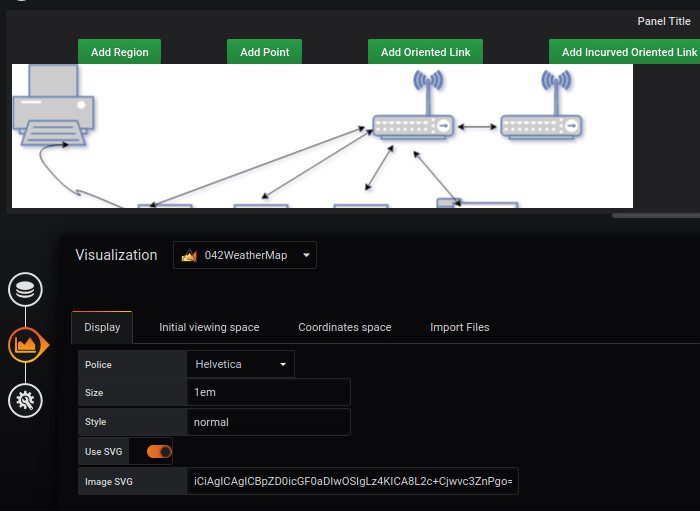
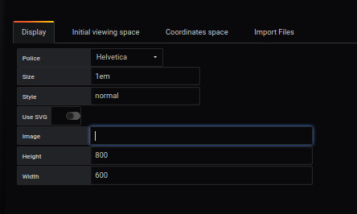
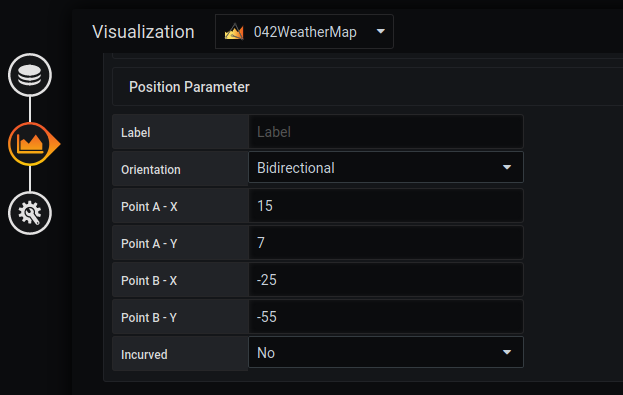
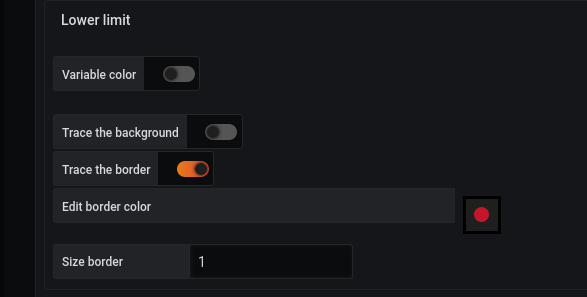
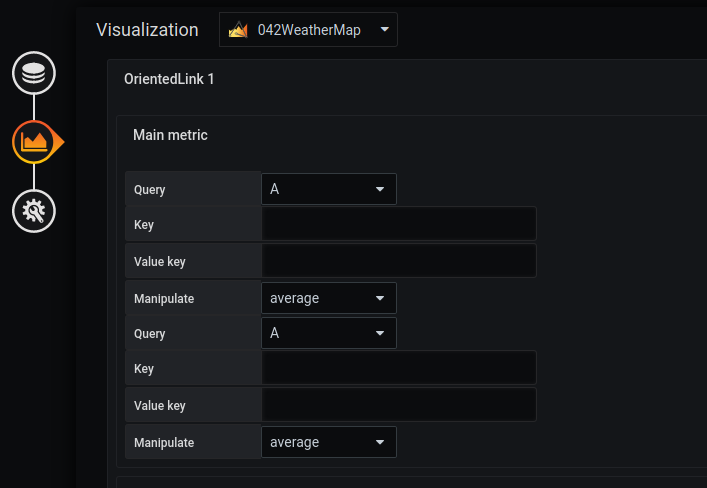

# Create bi directionnel

## Add a dashboard SVG

Adding a background image is done from the `display` menu.

The selected image will be [demo7-background.svg](../../resource/demo7-background.svg). To do this, we download it in base64 with the `Copy image address` function.

It is possible to have more details with the [display](../editor/display.md) page.

You have to save and reload the page.

## Create Routeur et ProxyServer regions

### Step 1: Define an SVG region

The creation of a region in an SVG image is done from the `Coordinates space`, `region` and `Add coordinate space` menu.

You have to fill out the form like this: 

- Enter a `label` for example Computer
- Select `SVG label`.
- Choose the `path 147` line from the drop-down list.
- Click on the `load` button

Repeat the same instruction for ProxyServer and Select `Proxy` for the zone SVG

### Step 2: Add a color to the SVG element

Adding a color to a SVG element is done from the `Coordinates space`, `region` and `Edit coordinate space` menu.

You select the `Lower limit' line and then complete the form like this: 
 

- Enable `Trace the background` to activate the background color. 
- Select the `green` color in the `Edit background color` line.
- Enable `Trace the border` to activate the border color.
- Select the `red` color in the `Edit border color` line.
- Enter a value to set the size of the border `size border` for example 3
- Click on the "load" button

You get the following result

Repeat the same things for the Routeur et choose the color red

It is possible to define other parameters, referring to the [coordinates lower limit](../editor/coordinates-lower-limit.md) page.

## Add Routeur and ProxyServer points

### Step 1 : add the routeur point

- To place a point, go to `Visualization`, then `Coordinates space`, `Point` and `Add coordinate space`.

You have to fill out the form like this: 

- Fill in the "label" of the point
- Inform his " size".
- Enter the X and Y position where you want the point to appear.

### Step 2 : Add the proxy point

You can also add a point using the panel available on the dashboard. A tutorial is [available here](../panel/panel-point.md)

## Add bi directionnel link between two points

### Step 1 : Add the link bidirectional

First, you have to click twice on `Add Oriented Link` and then, click on the Routeur point and on the ProxyServer Point.

A link will appaer and we will edit it to change it to Bidirectional point.

The option of direction is done from the `Coordinates space`, `OrientedLink` menu. Then, click on your link and go down.

### Step 2 : Choose the color of your link

### Step 3 : Add a query to your link

## Result

## Import JSON file

- It is possible to add all of those configuration through json files by doing an import. To know how to do it, [follow this link](../editor/import.md)

And here is the different JSON file :
- [demo7-Region](../../resource/demo7-region-svg.json) 
- [demo7-point](../../resource/demo7-point.json)
- [demo7-link](../../resource/demo7-link.json)
