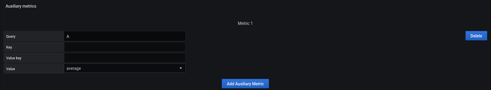
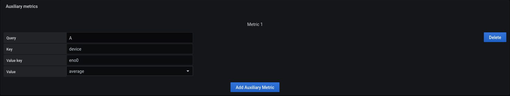

# Auxiliary metric

 

This function is common for 

- [Region](coordinates-space-region.md)
- [Point](coordinates-space-point.md)
- [Oriented Link](coordinates-space-link.md)

- It is in the interest of the auxiliary metric to add other values to a region or a point.
- The query of the metric hand is copied here. 
- "Key" and "Value key" allow you to filter the data received by the query to keep only what is important to you.

for example 

In the hypothesis where you retrieve several values, the following field proposes to return to you : 

- Average: Returns an average of the received values.
- Total: Returns the total sum of the received values.
- Error: Returns the value if this one is single, return error if there is several values

Choose the one you want.
