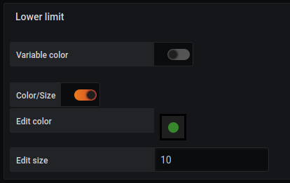

# Lower limit for link

### color fixed

If the `color variable` is unchecked, a form of this type appears

- Color/size : By checking this box, gives the possibility to change the background color and to give a size.
- Edit color: By clicking on the circle, you can choose the desired color. 
- Edit size: Allows you to choose the size of the link

### Variable color

if the `color variable` is checked, a new form appears to define the number of tiers required like this :

Fill in the number of steps (default 3)
Click on `add color`

You get this screen:

At each level, you have to fill in:

- A minimum value
- A maximum value
- Choose an interior color
- Choose a border size

