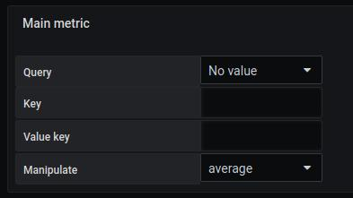
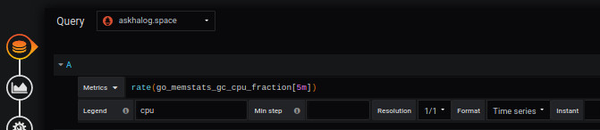
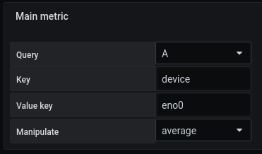

# Main metric

This part is common for

- [Region](coordinates-space-region.md)
- [Point](coordinates-space-point.md)
- [Oriented Link](coordinates-space-link.md)

The following parameter is used to

- Associate a predefined Query to a region or a point. This will allow you to define value and/or a color to a specific area according to the query.

- "Key" and "Value key" allow you to filter the data received by the query to keep only what is important to you.

for example

In the hypothesis where you retrieve several values, the following field proposes to return to you :

- Average: Returns an average of the received values.
- Total: Returns the total sum of the received values.
- Error: Returns the value if this one is single, return `error` if there are several values

Choose the one you want.

# See too

- [Tutorial 05 : Create a customizable query](../demo/tutorial05.md)
- [Tutorial 06 : Create modelisation advanced](../demo/tutorial06.md)
