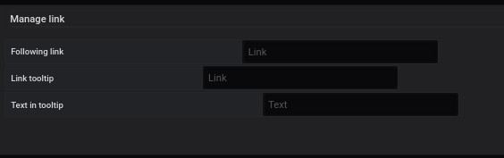

# Manage link

This part is common for 

- Region
- Point

3 links are available

- Following link : Allows a redirection towards the link by clicking on the region or on the point.

- Link tooltip : Allows a redirection to the link filled in the tool type by clicking on the link.

- Text in tooltip: Displays the link in the tooltip that appears when the cursor is passed over the area or point.
