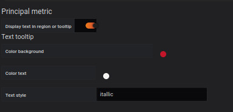
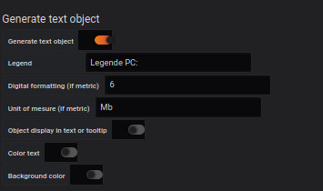
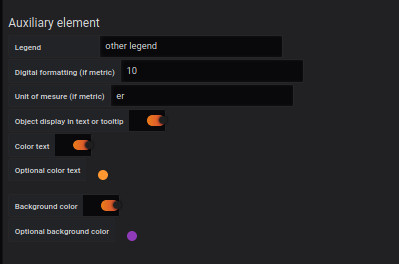

# Text object

This part is common for

- [Region](coordinates-space-region.md)
- [Point](coordinates-space-point.md)
- [Oriented Link](coordinates-space-link.md)

### Principal metrics

#### Region

By unchecking this option, the label name will be displayed in the defined region.

Several options for displaying the text in the region will then appear:

- Color Background: Allows you to choose the background color
- Color Text: Allows you to choose the color of the text.
- Text style: Choose between bold, italic or underline text style

#### Tooltip

By checking this option, the name of the label and the link "Link tooltip" will be displayed in the tooltip that appears when passing the cursor on the region.

Several options for displaying the text in the tooltip then appear:

- Color Background: Allows you to choose the background color
- Color Text: Allows you to choose the color of the text.
- Text style: Choose between bold, italic or underline text style

### Generate texte object

By checking this option, you will want to display the value of the metric. You then have different options:

- Legend : Allows you to add a legend before displaying the metric value.
- Digital formatting : Allows you to round the value of the metric (To be defined)
- Unit of measurement : Allows you to display the unit of measurement of the metric value.
- Object display in text or tooltip : By checking this box, the value of the metric will be displayed in the tooltip.
- Color text : By checking this box, you can choose a color for the text of the metric value.
- Background color : By checking this box, you can choose a color for the background of the metric value.

### Auxiliary element

By checking this option, you will want to display the value of the auxiliary defined beforehand. You then have different options:

- Legend: Allows you to add a legend before displaying the value of the metric.
- Digital formatting: Allows you to round the value of the metric (To be defined)
- Unit of measurement: Allows you to display the unit of measurement of the metric value.
- Object display in text or tooltip : By checking this box, the value of the metric will be displayed in the tooltip.
- Color text: By checking this box, you can choose a color for the text of the metric value.
- Background color: By checking this box, you can choose a color for the background of the metric value.

# See too

- [Tutorial 01 : Add a dashboard SVG](../demo/tutorial01.md)
- [Tutorial 05 : Create a customizable query](../demo/tutorial05.md)
- [Tutorial 06 : Create modelisation advanced](../demo/tutorial06.md)
- [Tutorial 07 : Create bi directionnel](../demo/tutorial07.md)
- [Tutorial 10 : How to add a global json file](../demo/tutorial10.md)
