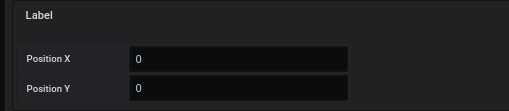
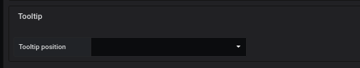
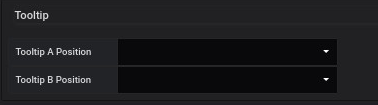
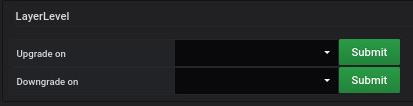

# Position parameter

This part is common for

- [Region](coordinates-space-region.md)
- [Point](coordinates-space-point.md)
- [Oriented Link](coordinates-space-link.md)

## Label

You can define the position of the label : 

- Position X 
- Position Y

So you can move the label away from the position to allow better reading

If you select the `bi-directional` orientation in the `OrientedLink` tab, the fields will be doubled to allow the label to be positioned differently for each part of the link, it is directional

Part A

  - Position in X
  - Position in Y

Part B

  - Position out X
  - Position out Y

## Tooltip

* The tooltip position positions itself in relation to the object (region, point, link). So you can define the location of the tooltip, as : 

  - Top
  - Bottom
  - Right
  - Left

  
 

If you select the `bi-directional` orientation in the `OrientedLink` tab, you can set the link position

Part A

  - Top
  - Bottom
  - Right
  - Left

Part B

  - Top
  - Bottom
  - Right
  - Left

## Layer level

 

the `Layer lavel` parameter is only available for the `OrientedLink` tab. You can perform the following operation : 

  - Upgrade on : choose the other link that you want to see below this one
  - Downgrade on : choose the other link that you want to see above this one
  

# See too

- [Tutorial 02 : Add a dashboard PNG/JPEG](../demo/tutorial02.md)
- [Tutorial 14 : Advanced dynamic template](../demo/tutorial14.md)
