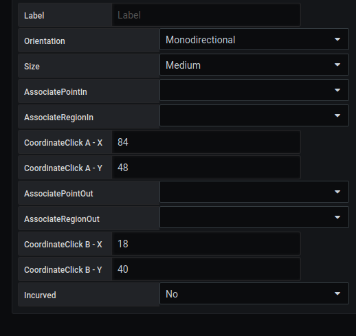

# Oriented Link

 
Defining the coordinates of an oriented link

## **Required information**

The required information to display the points is : 

## Label 

This is a key to add the result of a value to the parameters 

## Orientation

2 orientations are possible: 

- monodirectional
- bi-directional

## Size

Allow you to chosse the size of the link between Small, Medium and Large

## AssociatePoint/RegionIn and AssociatePoint/RegionOut

Allows you to define the starting and ending object of your link, it could be between points and/or regions.

## CoordinatClickA/B-X/Y

If hte link is not associate to an object, these inputs are used to define the starting and ending points of the link.

## Incurved

It is possible to add a point to make a curved curve.

To do this, you add a new point C in the X and Y position.

## **Other parameter**

## Main metric

A dedicated page to fill in the fields is available [here](coordinates-space-main-metric.md)

## Auxiliary metrics

A dedicated page for filling in the fields is available [here](coordinates-auxiliary-metric.md)

## Manage link

A dedicated page to fill in the fields is available [here](coordinates-manage-link.md)

## Text object

A dedicated page to fill in the fields is available [here](coordinates-object-text.md)

## LowerLimit

A dedicated page to fill in the fields is available [here](coordinates-lower-limit.md)

## Position Parameter

You can define the position of the 

  - The position of the label in X and Y

  - The tooltip position : 
    - up
    - down
    - right
    - left 

  - Layer level
    - Upgrade on : choose the other link that you want to see bellow this one
    - Downgrade on : choose the other link that you want to see above this one

