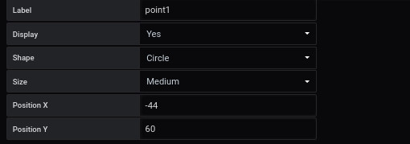

# Point

Define the coordinates of the points

## Mandatory information

The required information to display the points are :

- Label : C'est une clé pour ajouter le résultat de la valeur aux paramètres
- Display : Voir ou pas voir le point
- Shape : Choisir une forme : none / Circle / Square / Diamond
- Size : Allows you to choose the size of the link by typing a number (ex: 1 to 128)
- Position : position X et Y

Si vous avez choisi d'ajouter, il faut cliquer sur **save** Si vous êtes en mode édition, la mise à jour sera automatique

## Other parameter

### Main metric

A dedicated page for filling in the fields is available [here](coordinates-main-metric.md)

### Auxiliary metrics

A dedicated page for filling in the fields is available [here](coordinates-auxiliary-metric.md)

### Metadata

A dedicated page to fill in the fields is available [here](coordinates-metada.md)

### Manage link

A dedicated page to fill in the fields is available [here](coordinates-manage-link.md)

### Text object

A dedicated page to fill in the fields is available [here](coordinates-object-text.md)

### Lower Limit

A dedicated page to fill in the fields is available [here](coordinates-lower-limit.md)

### Position Parameter

A dedicated page to fill in the fields is available [here](coordinates-position-parameter.md)

# See too

- [Tutorial 03 : Create dashboard Avanced with link directionnel](../demo/tutorial03.md)
