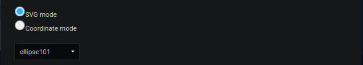
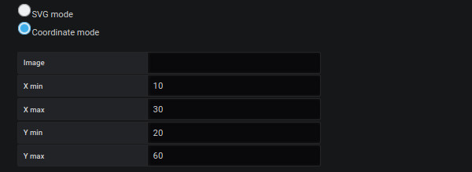
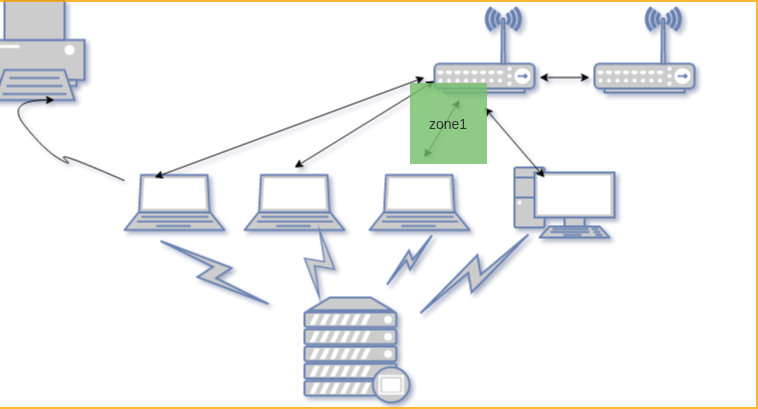

# Region

Allows the creation of a region

## Required information

### Label 

This is a key to add the result of a value to the parameters 

### SVG mode

Allows you to define an SVG element as a region (A screen, a button or others)

### Coordinate region

Allows you to define the coordinates of a region on the same basis as the "Initial viewing space" tab.

## Main metric

A dedicated page for filling in the fields is available [here](coordinates-main-metric.md)

## Manage link

A dedicated page to fill in the fields is available [here](coordinates-manage-link.md)

## Text object

A dedicated page to fill in the fields is available [here](coordinates-object-text.md)

## Lower Limit

A dedicated page to fill in the fields is available [here](coordinates-lower-limit.md)

