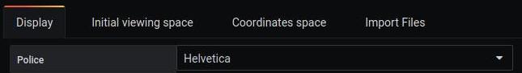
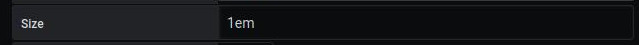
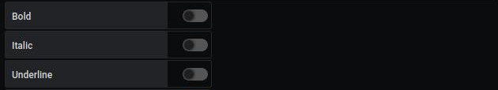
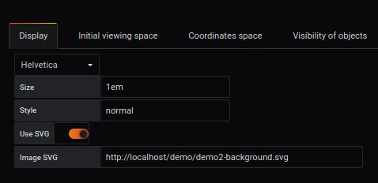
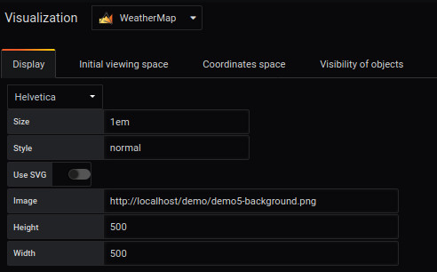
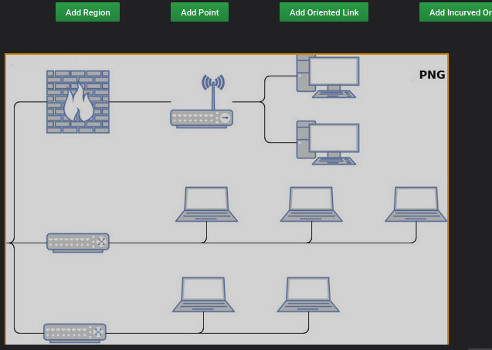
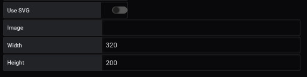
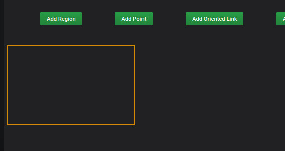
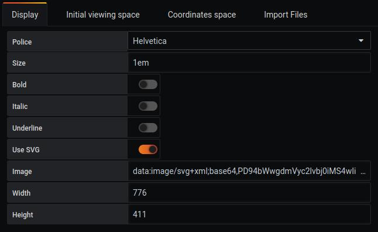
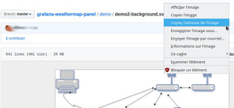

# Display

## Character font

The font list uses the standard fonts that are available in the browser.

You can choose the following font :

- "Helvetica"
- "Arial"
- "sans-serif"
- "mono"

## Size

Choice of text size in `em`. 

Example: `1em` oo `4em`.
 
 
 
## Style

Differents styles are possible: bold, italic, underlined, etc.

- bold: "True" or "False" to bold the text
- italic: "True" or "False" to italicize the text
- underline: "True" or "False" to put the text underline

        
        
## Use SVG

It allows you to download an SVG to be able to manage the regions. By unchecking, you can download any image but it will not be interactive.

## Picture

It is important to define a space to delimit its environment.

To do this, it is possible to load a background image using one of the methods suggested: 

### If you use SVG

#### Vector Image

This is a vector image in SVG format. The creation of the SVG file is described in the dedicated page : [Build an SVG file](../appendix/svg.md)

### If you don't use SVG

#### Bitmap image

It is an image created point by point with a content that is neither dynamic nor vectorial.

It is possible to load a background image in : 

- JPG or JPEG
- PNG
- GIF

You must fill in the space required to create your environment

- Width
- Height

to get the following result

#### No background image

You must fill in the space required to create your environment without background image :

- Width
- Height

to get the following result

## base 64

It is possible to load an image in *base 64* like this : 

to do that, you have to *copy the address of the image*

