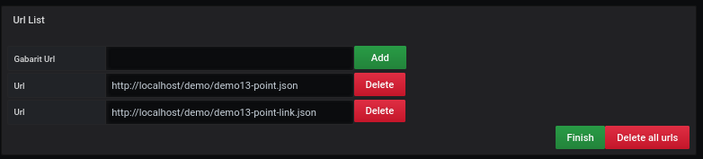

# Gabarit

[](README.md)

## Default Gabarit URL


For the Global import, it is necessary to fill in the link of the JSON file which includes all the necessary information to fill in the dashboard.

You enter the url of the file and click on the button `Finish`.

> You can only have one gabarit default file

The **gabarit** file must be declared as a JSON file like this:

```
{
  "global": {
     // global
  },
  "default": {
    "templates": [
      {
        // Point and/or Link and/or Region
      }
    ]
  }
}

```

This structure is fixed. The default template must imperatively have a region, a point and a link.

The decomposition of the file [default template](../appendix/gabarit-default.md) is available with full details.

## URL List



You must point to the template file by entering a link to the desired file.

After, you click on the `add` button, the link will be added in the related list.

To finish you have to click on `finish`.

You can add additional import files at will.

The **template** file must be declared as a JSON file like this:

```
{
  "global": {
    // global
  },
  "default": {
    "templates": [
      {
        // Point and/or Link and/or Region
      }
    ]
  },
  "templates": [
      {
        // Point and/or Link and/or Region
      },
   ]
}

```

It is important to note that you must have a **default templates** associated with a **template**, i.e. if you want to have a template (point or link or region) you must have a **default templates**.

You can have a template with link and region, then you will need a **default templates** with link and region

> If the rendering was just a region, you must have a region in **default templates** and **template**

This structure is fixed. The default template must imperatively have a region, a point and a link.

The decomposition of the file [default template](../appendix/gabarit-template.md) is available with full details.

## Gabarit List


This tab allows you to associate a template-template file with an ID request. When the association is done, you must click on **Load** so that Grafana can display the rendering.

> You must first have loaded a default gabarit

# See too

- [tutorial 13 : Dynamic gabarit](../demo/tutorial13.md)
- [tutorial 14 : Advanced dynamic template](../demo/tutorial14.md)
- [tutorial 15 : Multiple gabarit loading](../demo/tutorial15.md)
