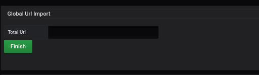
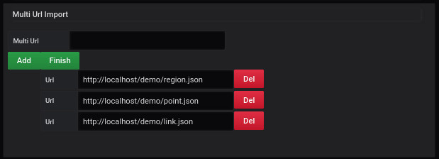
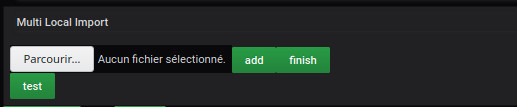

# Import Files

## Global URL Import

For the Global import, it is necessary to fill in the link of the .json file which includes all the necessary information to fill in the dashboard.

You enter the url of the file and click on the **Finish** button.

The result is instantaneous.

The decomposition of the file [global.json](../appendix/import-global.md) is available with all the details.

## Multi URL Import

For the Multi URL Import, you have to enter the required URLs in the field.
The different URLs are those of regions, points, and links.
You can find templates of the JSON type of these files at the following links:

- [region.json](../appendix/import-region.md)
- [point.json](../appendix/import-points.md)
- [lien.json](../appendix/import-links.md)

Afterward, you click on the `add` button if you want to add more URLs
To finish you have to click on `finish`.

The result is instantaneous

You can add additional import files at will

## Multi local Import

You select the file on your hard drive from the `Browse..` button.

After that, you click the `add` button, followed by the `finish` button.

The result is instantaneous
It is possible to upload an additional configuration file but you have to save the page and reload the page

# See too

- [Tutorial 10 : How to add a global json file](tutorial10.md)
