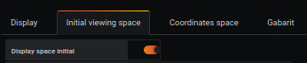

# Initial viewing space

This section allows you to resize your workspace.

## Pre-Requests

You must have defined a background space in the [Display](display.md) tab as the initial viewing space.

## Viewving space

The `Display space initial` line is useful if you do not choose a background image, therefore, it is important to see or hide the limits of the view.

The width (X MAX) and height (Y MAX) take the width and height values defined by the image you loaded from the Display tab.

## change the viewing space with the new graduation

By default, the viewing space will correspond to the dimensions of the background image.

The viewing space can be adjusted with a new graduation as needed:

- By increasing / decreasing the space to the right
- By increasing / decreasing the space on the left side
- By increasing / decreasing space at top
- By increasing / decreasing space at the bottom

>
> For example:
> If the graduation is 10 in X, this means that it is possible to put 10 points in X (0 TO 10)
> If we do the same thing in Y, we will have 10 points in Y (0 TO 10)
>

It is possible to leave with negative values.

>
> For example:
> If the graduation is -10 to 10 in X, this means that it is possible to put 20 points in X (-10 to + 10)
>

# See too

- [Tutorial 11 : How to use initial viewing space](../demo/tutorial11.md)
