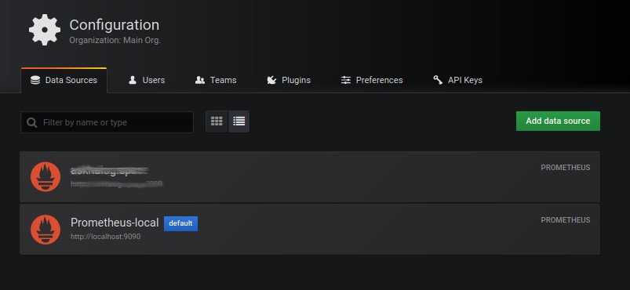
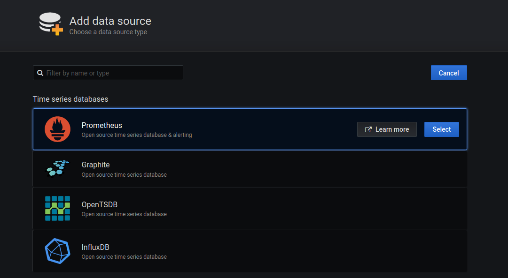
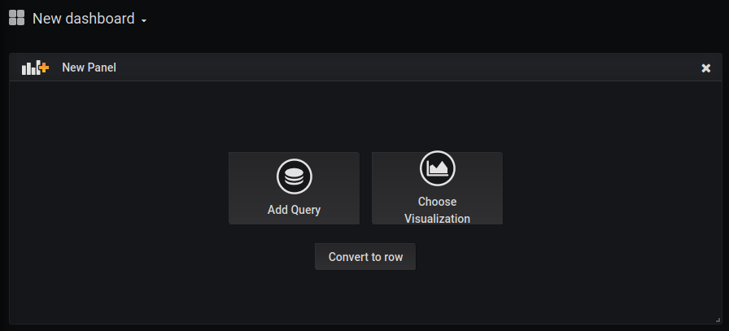
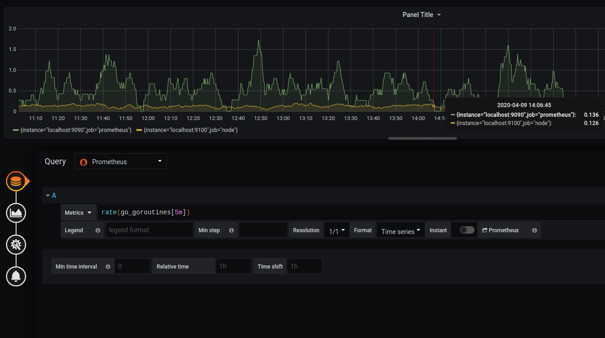

# Configuration data source

## Time Series Data as the Data Source

The plugin `grafana-weathermap-panel` can be use with all the database used in Grafana. 

Supported Databases:

- Graphite
- InfluxDB
- OpenTSDB
- Prometheus
- MySQL
- Postgres
- MSSQL 
- Elasticsearch

## Example of use with Prometheus

You can use Grafana's interface from the modules available above

### Add the data source

- On the side bar on the left, click on the `Configuration` button
- Click the `Add data source` button in the top header.
- Select Prometheus from the Type dropdown.

### Inserting a `query` into a dashboard

To insert a query into a dashboard, first, you have to create this dashboard and then create a panel.

- On the side bar on the left, click on the `Create Dashboard` button

- You will then click on `Add Query`

- Inside the parameter of the panel, you have to choose the Query. Here choose `Prometheus`
- Then you can choose the Metrics to visualize

### External

It is possible to use the connection without going through the Grafana interface.

