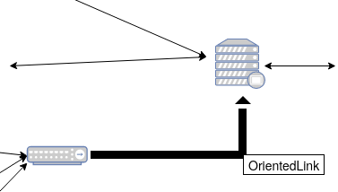

# Incurved link

 
After clicking on the **incurved oriented link** button

It is not available to have a configuration screen.

The display is done by clicking the mouse at the location of your choice. It is necessary to click three times on the image to position the point A then the point B which will represent the direction, then the point C which will define the curvature.

The result obtained will be automatically

The point is edited using the [editor oriented link](../editor/coordinates-space-link.md) form.

To access it, click on **Coordinate space**, then **OrientedLink**, then on your link
