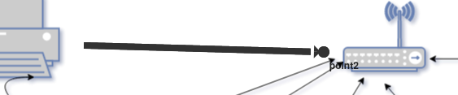

# Oriented link

To create an oriented link you have to click twice on the **Add Oriented link** button.

Then the display is done by clicking the mouse at the location of your choice.

It is necessary to click twice on the image to position point A and point B.

It is not available to have a configuration screen.

The result obtained will be automatically

The point is edited using the [editor oriented link](../editor/coordinates-space-link.md) form.

To access it, click on **Coordinate space**, then **OrientedLink**, then on your link

# See too

- [Tutorial 02 : Add a dashboard PNG/JPEG](../demo/tutorial02.md)
