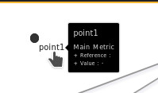

# Point

After clicking on the **point** button

It is not available to have a configuration screen.

The display of a point is done by clicking the mouse at the location of your choice.

The result will be automatically obtained.

The editing of the point is done from the form of the [Point editor](../editor/coordinates-space-point.md).

To access it, click on **Coordinate space**, then **Point**, then **Edit coordinate space**.

# See too

- [Tutorial 03 : Create dashboard Avanced with link directionnel](../demo/tutorial03.md)
