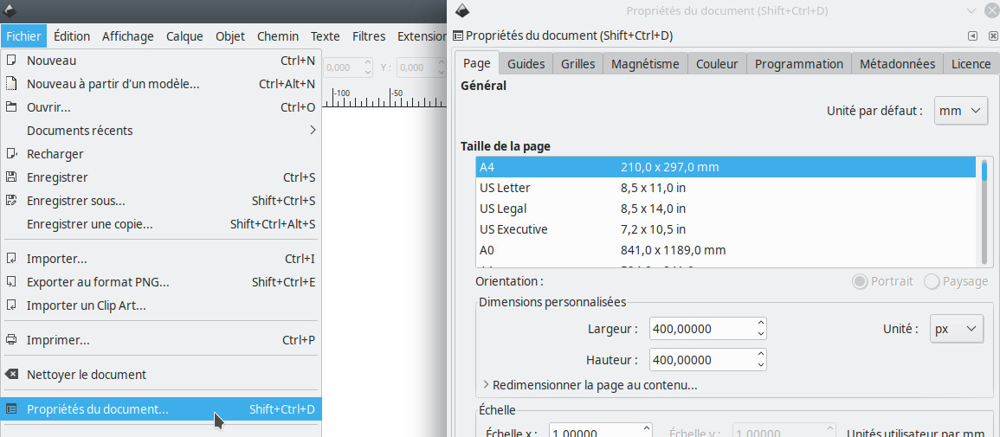
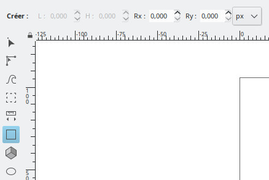
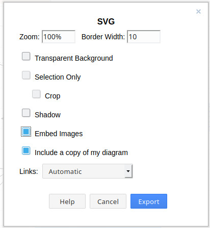

## Construire un fichier SVG

### Background

L'image de fond est une part entière du plugins.

Il est rendu possible de le rendre dynamique. Pour cela, l'image de fond doit être au format vectorisé [SVG](https://fr.wikipedia.org/wiki/Scalable_Vector_Graphics)

## Editeur

### Inkscape

Le logiciel préconisé pour réaliser une image de fond sera [Inkscape](https://inkscape.org). Il est disponible pour les environnements :

- Linux
- Windows
- Mac

#### Les propriétés

Lors du lancement du logiciel, vous devez déterminer les dimensions du document, qui servira d'espace d'initialisation. Pour cela, l'unité de mesure numérique définit sera le pixel (px).

L'accès à ce paramètre s'effectue à partir du menu propriétés.

> Il n'est pas nécessaire de créer un fond de plan de l'espace que vous venez de créer.

#### Les formes

Inkscape propose une interface simplifié. Il permet d'ajouter et de créer des formes et des objets dans les propriétés définit précédemment, qui sont :

- Cercle
- Carré
- Liens
- Autre...

Chaque objet créé, doit posséder un identifiant (ID) qui sera mis à disposition pour le plugin **Weathermap**.

Pour ajouter un identifiant à une forme graphique, vous devez faire `click droit` sur votre objet, puis allez sur `Propriétés de l'objet`. Une fenêtre apparaîtra et vous permettra de modifier l'identifiant.

#### Sauvegarde

Vous devez sauvegarder votre création au format **SVG simple** ou **SVG Inkscape** qui pourra être charger dans le display du plugin, avec comme extension SVG.

#### Demo

Vous pouvez consulter le [tutorial 4](../demo/tutorial04.md) associé pour la création d'un fichier SVG.

le fichier sera sauvegardé au format **SVG simple** ou **SVG Inkscape**

### Draw.io

L'éditeur [Draw.io](https://draw.io/) est accessible à partir d'un navigateur.

La version communautaire propose un large choix d'objet graphique déjà près à l'emploi.

L'activation des formes qui nous intéressent, sont les librairies shapes `networking` qui facilitera des visuels de votre réseau.

Vous devez exporter l'image au format SVG.

Les paramètres obligatoires à cocher sont `embed images`

#### Sauvegarde

Il est important que chaque élément doit posséder une clef `ID` pour que le fichier créé puisse être importer dans le plugin.

> Attention :
> il ne faut pas sauvegarder au format à plat, ni compresser le fichier
