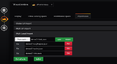

# Demo / Tutorial

Sous la forme d'une **démo**, vous apprendrez à utiliser le plugin pour obtenir un tableau de bord dynamique

- 1 [Ajoutez SVG dans votre tableau de bord](tutorial01.md)

  

- 2 [Ajoutez PNG/JPG dans votre tableau de bord](tutorial02.md)

  

- 3 [Créer un dashboard avancé avec des liens directionnels](tutorial03.md)

  

- 4 [Comment créer et ajouter votre propre image SVG dans Grafana](tutorial04.md)

  

- 5 [Créer une requête personnalisable](tutorial05.md)

  

- 6 [Créer une modélisation avancée](tutorial06.md)

  

- 7 [Créer un lien bi directionnel](tutorial07.md)

  

- 8 [Comment utiliser la métrique auxiliaire](tutorial08.md)

  

- 9 [Comment créer une région en mode coordonnée](tutorial09.md)

  

- 10 [Comment ajouter un fichier json global](tutorial10.md)

  

- 11 [Comment utiliser initial viewing space](tutorial11.md)

  

- 12 [Construire son dashboard depuis son ordinateur](tutorial12.md)

  
