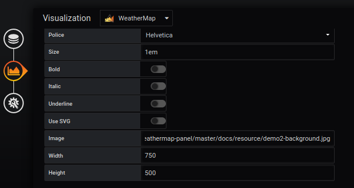
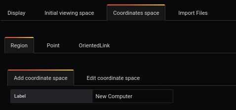
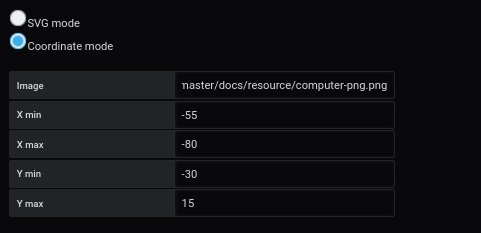
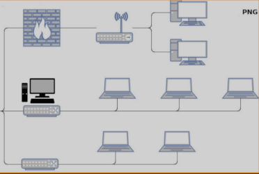
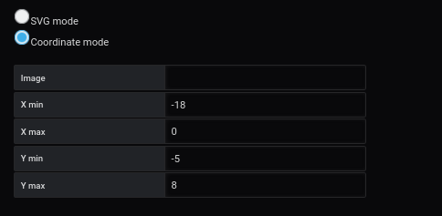
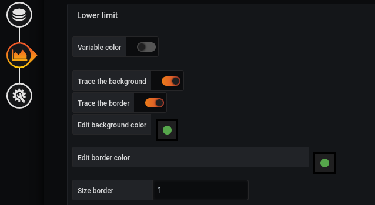
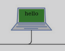
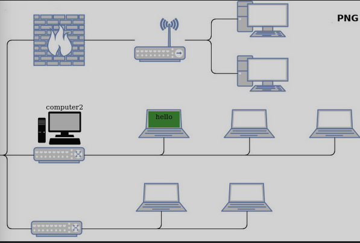
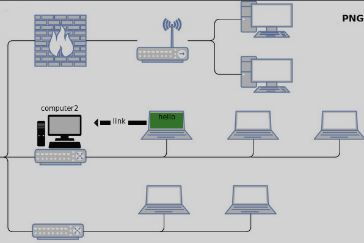

# Ajoutez PNG/JPG dans votre tableau de bord
[](README.md)
 
## Ajouter une image comme affichage
Pour ce tutoriel, vous devez d'abord télécharger l'image de fond : 





L'ajout d'une image de fond se fait à partir du menu `display`.

L'image sélectionnée sera [demo02-background.jpg](../../resource/demo02-background.jpg). Pour ce faire, nous la téléchargeons en base64 avec la fonction `Copier l'adresse de l'image`.

```
https://raw.githubusercontent.com/atosorigin/grafana-weathermap-panel/master/docs/resource/demo02-background.jpg
```

Il est possible d'avoir plus de détails avec la page [display](../editor/display.md).


## Définir une région en mode coordonnée avec une image

### Ajouter une image dans une région

La création d'une région dans une image SVG se fait à partir du menu `Coordinates space`, `region` puis `Add coordinate space`.



Vous devez remplir le formulaire comme ceci : 

- Entrer un `label` par exemple : ordinateur
- Selectionner `Coordinate mode`.
- Puis choisissez une image

Pour finir
- Cliquez sur le bouton `save`


L'image sélectionnée sera [cumputer-png.png](../../resource/computer-png.png). Pour ce faire, nous la téléchargeons en base64 avec la fonction `Copier l'adresse de l'image`.

Definissez ensuite la taille de la région pour votre image. Ici, nous choisirons :

- X Min : -55
- X Max : -80 
- Y Min : -30
- Y Max : 15




### Résultat

Le résultat final sera le suivant : 



## Définir une région en mode de coordination sans image

### Étape 1 : Créer la région

La création d'une région dans une image SVG se fait à partir du menu `Coordinates space`, `region` puis `Add coordinate space`.


Vous devez remplir le formulaire comme ceci : 

- Entrez un `label` par exemple  ordinateur
- Sélectionnez `Coordinate mode`.




Definissez ensuite la taille de la région pour votre image. Ici, nous choisirons :

- X Min : -18
- X Max : 0
- Y Min : -5
- Y Max : 8

Pour finir
- Cliquez sur le bouton `save`

### Étape 2 : Ajouter une couleur à une région




L'ajout d'une couleur à un élément SVG se fait à partir du menu `Coordinates space`, `region` puis `Edit coordinate space`.

Sélectionnez la ligne `lower limit` et remplissez ensuite le formulaire comme ceci : 
 

- Cocher `Trace the background` pour activer la couleur de fond. 
- Sélectionnez la couleur `verte` dans la ligne `Editer la couleur de fond`.


Vous obtenez le résultat suivant




Il est possible de définir d'autres paramètres, en se référant à la page [coordinates lower limit](../editor/coordinates-lower-limit.md).

### Résultat

Le résultat final sera le suivant : 



## Définir un lien orienté entre deux régions

Pour créer un lien orienté, vous devez passer par [le menu du panneau](../panel/panel-oriented-link.md).

Vous pouvez aussi vous rendre au [tutoriel3](tutorial3.md) qui explique comment faire


## Résultat final 




### Importer un fichier JSON

- Il est possible d'ajouter toutes ces configurations par le biais de fichiers json en faisant une importation. Pour savoir comment faire, [suivez ce lien](../editor/import.md)

Et voici les différents fichiers JSON :


- [demo02-CoorRegion](../../resource/demo02-CoorRegion.json) 
- [demo02-link](../../resource/demo02-link.json)

