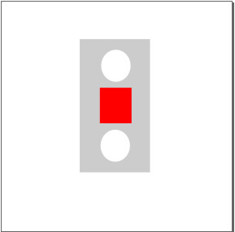
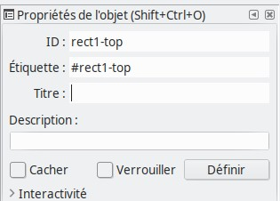
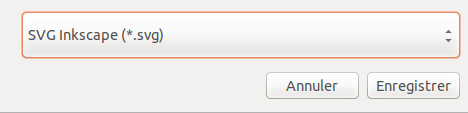
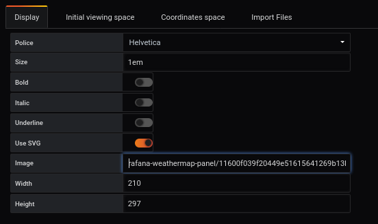
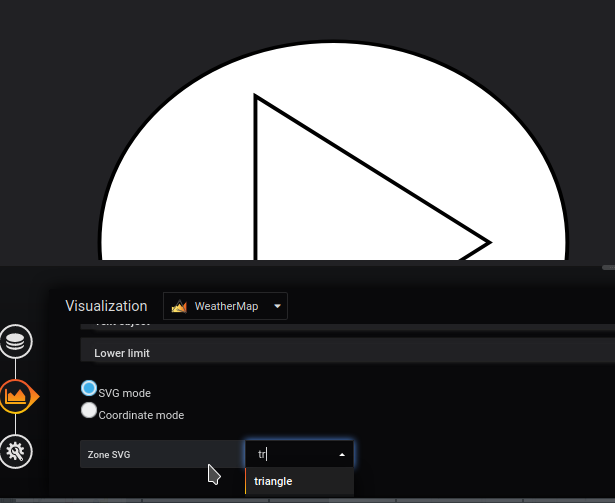

# Comment créer et ajouter votre propre image SVG dans Grafana

 
## Créer votre SVG avec inkscape

### Propriétés de l'espace

A partir du logiciel Inkscape, nous définissions les propriétés de notre espace en pixel avec comme valeurs : 

  - largeur : 400 px
  - hauteur : 400 px

Vous pouvez également voir plus d'informations sur la création d'image SVG [ici](../appendix/svg.md)

### Étape 2 : Créer votre forme

Nous créons plusieurs formes géométriques à partir du logiciel Inskcape, qui sont : 

  - 2 rectangles
  - 2 cercles

### Etape 3 : Ajouter un identifiant à tous vos objets

Il est nécessaire d'ajouter un identifiant à tous vos objets. Il sera plus facile à utiliser avec grafana.

Pour ajouter un identifiant, `right click` sur votre objet, puis allez sur `Properties of your object`. Une fenêtre apparaîtra et vous permettra de modifier l'identifiant

### Étape 4 : Sauvez votre forme

Pour sauvegarder votre forme, vous devez enregistrer au format `SVG Inkscape` ou `SVG simple`.

## Ajoutez votre SVG à Grafana

L'ajout d'une image de fond se fait à partir du menu `display`.

L'image que vous venez de créer sera uploader à partir de votre ordinateur. Pour ce faire, vous cliquez sur `parcourir` de la ligne upload image, que vous trouverez [ici](../../resource/demo04-background.svg)

Il est possible d'avoir plus de détails avec la page [display](../editor/display.md).

Ensuite, si vous voulez ajouter une région, à partir du menu `Coordinates space`, `region` et `Add region`. Vous pouvez voir les différents id de votre forme dans "Zone SVG". 

