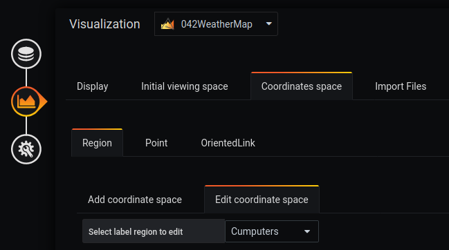

# Créer un lien bi directionnel
[](README.md)

## Ajouter un tableau de bord SVG

! [étape 01](../../screenshots/demo/tutorial07/background.jpg)


L'ajout d'une image de fond se fait à partir du menu `display`.

L'image sélectionnée sera [demo7-background.svg](../../resource/demo07-background.svg). Pour ce faire, nous la téléchargeons en base64 avec la fonction "Copier l'adresse de l'image".


```
https://raw.githubusercontent.com/atosorigin/grafana-weathermap-panel/master/docs/resource/demo07-background.svg
```

Il est possible d'avoir plus de détails avec la page [display](../editor/display.md).

Vous devez sauvegarder et recharger la page.


## Créer des régions Routeur et ProxyServer


### Étape 1 : Définir une région SVG


La création d'une région dans une image SVG se fait à partir du menu `Coordinates space`, `region` et `Add coordinate space`".

Vous devez remplir le formulaire comme ceci : 

- Entrez un `label` par exemple Ordinateur
- Sélectionnez `SVG label`.
- Choisissez la ligne `path 147` dans la liste déroulante.
- Cliquez sur le bouton `load`

Répétez la même instruction pour ProxyServer et sélectionnez `Proxy` pour la zone SVG

### Étape 2 : Ajouter une couleur à l'élément SVG


L'ajout d'une couleur à un élément SVG s'effectue à partir du menu `Coordinates space`, `region` et `Edit coordinate space`

Vous sélectionnez la ligne `Lower limit` pour compléter le formulaire comme ceci : 
 

- Activer `Trace the background` pour activer la couleur d'arrière-plan 
- Sélectionner la couleur `verte` à la ligne `Edit background color`
- Activer `Trace the border` pour activer la couleur de bordure
- Sélectionner la couleur `rouge` à la ligne `Edit border color`
- Saisir une valeur pour définir la taille de la bordure `size border` par exemple 3
- Cliquer sur le bouton `load`

Vous obtenez le résultat suivant


Répétez les mêmes choses pour le Routeur et choisissez la couleur rouge

Il est possible de définir d'autres paramètres, en se référant à la page [coordinates lower limit](../editor/coordinates-lower-limit.md) 


## Ajouter un lien bi directionnel entre deux points


### Étape 1 : Ajout du lien bidirectionnel

D'abord, vous devez cliquer deux fois sur  `Add Oriented Link` et ensuite, cliquer sur le point Routeur et sur le point ProxyServer.

Un lien apparaîtra et nous l'éditerons pour le changer en point Bidirectionnel.

Les options d'orientation se font à partir du menu `Coordinates space`, `OrientedLink`. Ensuite, cliquez sur votre lien et descendez.

Puis, sélectionnez `Bidirectional` pour l'orientation


### Étape 2 : Choisissez la couleur de votre lien

Pour changer la couleur, allez dans le menu `lower limit`.


### Étape 3 : Ajouter une query à votre lien

Vous devez d'abord créer la requête.
Pour ce faire, allez à "Requêtes" et remplissez les champs comme suit :


```
Metric A :

rate(node_network_receive_bytes{device="enp0s3"}[10s])*100*8/1024/1024


Metric B : 

rate(node_network_transmit_bytes{device="enp0s3"}[10s])*100*8/1024/1024
```

Ensuite, vous pourrez attribuer les méstriques à vos liens A et B


## Ajouter un lien cliquable

### Etape 1 : Ajouter une région avec le mode Coordonnées

La création d'une région en mode coordonnées se fait à partir du menu `Coordinates space`, `region` et `Add coordinate space`

Vous devez remplir le formulaire comme ceci : 

- Entrez une `label` par exemple Ordinateur
- Sélectionnez `coordinate mode`.
- Remplissez les coordonnées de votre région
- Cliquez sur le bouton `load`




### Étape 2 : Ajouter un lien

Sur cette même région, il est possible d'ajouter un lien cliquable.
Pour ce faire, allez dans la rubrique Gérer le lien et remplissez le formulaire comme suit :

- `Following link` : Permet de rediriger vers le lien en cliquant sur la région ou sur le point.
- `Link tooltip` : Permet une redirection vers le lien rempli dans le type d'outil en cliquant sur le lien.
- `Text in tooltip` : Affiche le lien dans l'info-bulle qui apparaît lorsque le curseur est passé sur la région ou sur le point.


Vous pouvez alors constater sur cette image que le lien est cliquable


## Résultat


## Importer un fichier JSON

- Il est possible d'ajouter toutes ces configurations par le biais de fichiers json en faisant une importation. Pour savoir comment faire, [suivez ce lien](../editor/import.md)

Et voici les différents fichiers JSON :

- [demo7-Region](../../resource/demo07-region-svg.json) 
- [demo7-point](../../resource/demo07-point.json)
- [demo7-link](../../resource/demo07-link.json)
