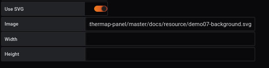
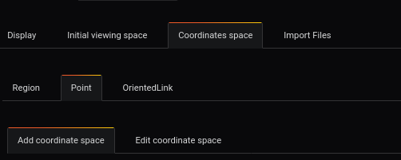
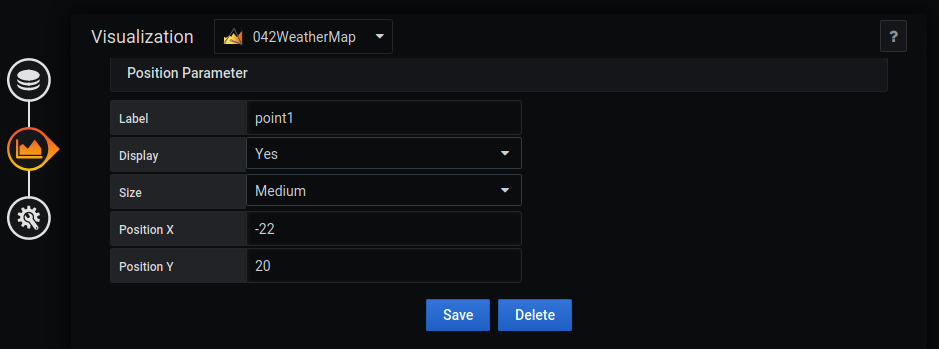
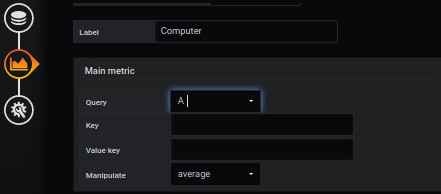
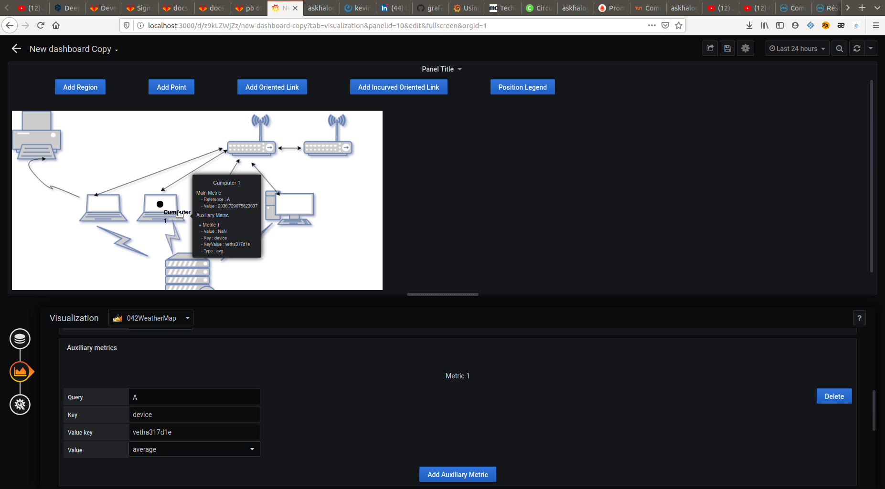

# Comment utiliser la métrique auxiliaire
[](README.md)
 
## Ajouter un tableau de bord SVG




L'ajout d'une image de fond se fait à partir du menu `display`.

L'image sélectionnée sera [demo7-background.svg](../../resource/demo07-background.svg). Pour ce faire, nous la téléchargeons en base64 avec la fonction "Copier l'adresse de l'image".


```
https://raw.githubusercontent.com/atosorigin/grafana-weathermap-panel/master/docs/resource/demo01-background.svg
```

Il est possible d'avoir plus de détails avec la page [display](../editor/display.md).

Vous devez sauvegarder et recharger la page.

## Ajouter une métrique auxiliaire à un point

### Étape 1 : Ajouter un point




- Pour placer un point, il faut se rendre dans `Visualization`, puis `Coordinates space`, `Point` et `Add coordinate space`.



Vous devez remplir le formulaire comme ceci : 

- Renseigner le `label` du point
- Renseigner sa `size`
- Saisir la position X et Y ou vous voulez voir le point apparaitre

### Etape 2 : Ajout de la métrique principale


La première étape est l'onglet  `Queries`

Vous devez :

- Compléter la ligne `metrics` avec la ligne suivante

```
rate(go_memstats_gc_cpu_fraction[5m]) * 100000
```

Le marqueur "A" sera utilisé pour identifier cette requête, comme vous pouvez le voir ci-dessous.

Une fois que vous aurez fait cela, vous associerez cette requête à votre point




La deuxième étape se fait à partir du menu `Coordinates space`, `region` et `Edit coordinate space` de l'onglet `visualization`.

Vous sélectionnez la ligne `Main metric` pour remplir le formulaire comme ceci : 

- Entrez une `Query` par exemple A
- Cliquez sur le bouton `load`


La valeur sera automatiquement affichée après le rafraîchissement de la page.


Il est possible de remplir les autres champs avec les paramètres supplémentaires disponibles sur la page [coordinates space region](../editor/coordinates-space-region.md)

### Étape 3 : Ajouter une métrique auxiliaire 

Allez à la rubrique `Auxiliary metrics` et remplissez le formulaire comme `Main metric`


Après cela, vous pourrez voir votre métrique auxiliaire dans la toolbox de votre point




### Importer un fichier JSON

- Il est possible d'ajouter toutes ces configurations par le biais de fichiers json en faisant une importation. Pour savoir comment faire, [suivez ce lien](../editor/import.md)

Et voici le fichier JSON :

- [demo5-region](../../resource/demo08-point.json) 
