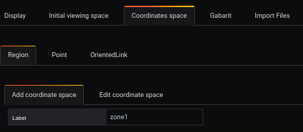
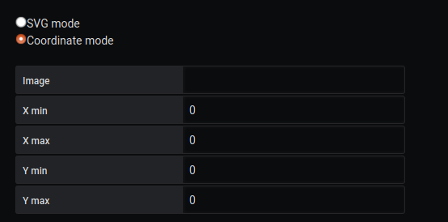

# Comment créer une région en mode coordonnée

[](README.md)

## Ajouter un dashboard SVG


L'ajout d'une image de fond se fait à partir du menu `display`.

L'image sélectionnée sera [demo01-background.svg](../../resource/demo01-background.svg).

Pour ce faire, nous la téléchargeons en base64 avec la fonction `Copier l'adresse de l'image`, ou avec le lien direct du dépôt :

```
https://raw.githubusercontent.com/atosorigin/grafana-weathermap-panel/master/docs/resource/demo01-background.svg

```

Les dimensions (largeur x hauteur) seront automatiquement renseignées.

Il est possible d'avoir plus de détails avec la page [display](../editor/display.md).

## Ajouter une région avec le mode de coordonnées

Dans cette section, nous expliquons comment créer différentes régions sur le dashboard avec le mode de coordonnées.



L'accès s'effectue à partir du menu `Coordinates space`, `region` et `Àdd coordinate space`. Nous renseignons le `label`



Ici, nous pouvons voir une section avec `X min`,`X max`,`Y min`,`Y max`.

Le point de référence est le point (0,0) qui se trouve en bas à gauche de l'image.

Créons ces trois régions sur le tableau de bord.

Nous aurons donc les données suivantes :

Region 1


Region 2


Region3


## Ajoutez de la couleur à nos régions

Nous ajouterons différentes couleurs à nos régions pour les différencier. Allez à la `LowerLimit` et activez `Trace the border`. Ensuite, choisissez une couleur et une taille pour la frontière


## Résultat

Une fois que vous avez fait cela pour vos trois régions, vous devriez avoir quelque chose comme cela :


### Importer un fichier JSON

- Il est possible d'ajouter toutes ces configurations par le biais de fichiers json en faisant une importation. Pour savoir comment faire, [suivez ce lien](../editor/import.md)

Et voici le fichier JSON :

- [demo09-region](../../resource/demo09-region.json)
