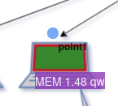

## Ajouter un dashboard SVG


## Création d'un région dynamique

L'ajout d'une image de fond se fait à partir du menu `display`.


L'image sélectionnée sera [demo1-background.svg](../../resource/demo1-background.svg). Pour ce faire, nous la téléchargeons en base64 avec la fonction `Copier l'adresse de l'image`.


```
https://raw.githubusercontent.com/atosorigin/grafana-weathermap-panel/master/docs/resource/demo1-background.svg

```

Il est possible d'avoir plus de détails avec la page [display](../editor/display.md).

Vous devez sauvegarder et recharger la page.

## Créer une région dynamique


### Etape 1 : Définir une région SVG


La création d'une région dans dans une image SVG s'effectue à partir du menu `Coordinates space`, `region` et `Àdd coordinate space`

Vous devez remplir le formulaire comme ceci : 

- Saisir un `label` par exemple Computer
- Sélectionner `SVG label`
- Choisir dans la liste déroulante, la ligne `path 147`
- Cliquer sur le bouton `load`


### Etape 2 : Ajouter une couleur à l'élément SVG


L'ajout d'une couleur à un élément SVG s'effectue à partir du menu `Coordinates space`, `region` et `Edit coordinate space`

Vous sélectionnez la ligne `Lower limit` pour compléter le formulaire comme ceci : 
 

- Activer `Trace the background` pour activer la couleur d'arrière plan 
- Sélectionner la couleur `vert` à la ligne `Edit background color`
- Activer `Trace the border` pour activer la couleur de bordure
- Sélectionner la couleur `rouge` à la ligne `Edit border color`
- Saisir une valeur pour définir la taille de la bordure `size border` par exemple 3
- Cliquer sur le bouton `load`


Vous obtenez le résultat suivant


Il est possible de définir d'autres paramètres, en vous référant à la page [coordinates lower limit](../editor/coordinates-lower-limit.md)


### Etape 3 : Ajouter une Query à un élément SVG


La première étape passe par l'onglet `Queries`

Vous devez :

- compléter la ligne `métrics` avec la ligne suivante

```
rate(go_memstats_gc_cpu_fraction[5m]) * 100000
```

Le point de repère sera `A` qui sera le code utilisé ci-dessous

Les paramétrages complémentaires sont disponible à la page ......


La deuxième étape s'effectue à partir du menu `Coordinates space`, `region` et `Edit coordinate space` de l'onglet `visualization`

Vous sélectionnez la ligne `Main metric` pour compléter le formulaire comme ceci : 

- Saisir un `Query` par exemple A
- Cliquer sur le bouton `load`


La valeur sera automatiquement affichée après le rafraichissement de la page


Il est possible de compléter les autres champs avec les paramétrages complémentaires disponible à la page ....


### Etape 4 : Mise en forme des informations de l'élément SVG


La mise en forme des informations de l'élément SVG s'effectue à partir du menu `Coordinates space`, `region` et `Edit coordinate space`

Vous sélectionnez la ligne `Text object` pour compléter le formulaire `Generate text object`comme ceci : 

- Saisir une `légende`
- Saisir le nombre de chiffre après la virgule dans `Digital formating` par exemple 2
- Saisir une unité de mesure à la ligne `unit of mesure` comme qw
- Choisir une couleur d'arrière plan
- Choisir une couleur de texte
- Cliquer sur le bouton `load`

### Résultat

Le résultat final sera comme cela : 


## Création d'un point 


### Etape 1 : Placer un point


- Pour placer un point, il faut se rendre dans `Visualization`, puis `Coordinates space`, `Point` et `Add coordinate space`.


Vous devez remplir le formulaire comme ceci : 

- Renseigner le `label` du point
- Renseigner sa `size`
- Saisir la position X et Y ou vous voulez voir le point apparaitre


### Step 2: Add a color to the point


Adding a color to a SVG element is done from the `Coordinates space`, `point` and `Edit coordinate space` menu.

You select the `Lower limit' line and then complete the form like this: 
 

- Enable `Trace the background` to activate the background color. 
- Select the `green` color in the `Edit background color` line.
- Enable `Trace the border` to activate the border color.
- Select the `red` color in the `Edit border color` line.
- Enter a value to set the size of the border `size border` for example 3
- Click on the "load" button


You get the following result




It is possible to define other parameters, referring to the [coordinates lower limit](../editor/coordinates-lower-limit.md) page.


### Step 3: Adding a Query to a point


As seen in the previous section, we need a metric. So you can use the same metric as before, or you can give another metric B

Once you have done that, you will associated this query to your point


The second step is from the `Coordinates space`, `region` and `Edit coordinate space` menu of the `visualization` tab.

You select the `Main metric` line to complete the form like this: 

- Enter a `Query` for example A
- Click on the `load` button


The value will be automatically displayed after the page is refreshed.


It is possible to fill in the other fields with the additional settings available on the page [coordinates space region](../editor/coordinates-space-region.md)


### Résultat

The end result will be like this: 


## Création d'un lien orienté


### Etape 1 : Placer un lien orienté

To create an oriented link you have to pass by [the panel menu](../panel/panel-oriented-link.md).

### Step 2: Adding a Query to a link

Once you have place you link on the image you can go to `Coordinates space` and `point` menu of the `visualization` tab.


Here, you can see your link `OrientedLink 1`

You select the `Main metric` line to complete the form like this: 

- Enter a `Query` for example A
- Click on the `load` button


The value will be automatically displayed after the page is refreshed.


It is possible to fill in the other fields with the additional settings available on the page [coordinates space link](../editor/coordinates-space-link.md)

