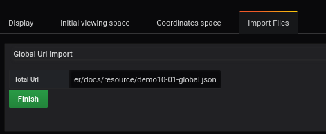
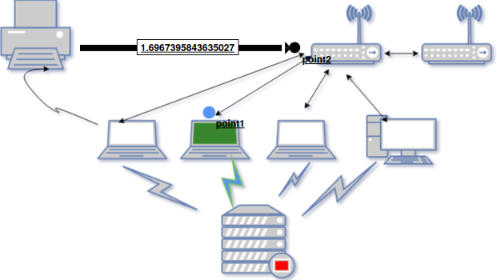

# Comment ajouter un fichier json global 
[](README.md)

##  Ajouter une Query


La première étape passe par l'onglet `Queries`

Vous devez :

- compléter la ligne `metrics` avec la ligne suivante

```
rate(go_memstats_gc_cpu_fraction[5m]) * 100000
```

Le marqueur "A" sera utilisé pour identifier cette requête


## Créer le fichier json global

Pour créer le fichier global json, vous pouvez aller dans le [fichier d'importation](./../editor/import.md) et suivre les instructions

## Ajouter le fichier global

Pour ce tutoriel, nous utiliserons le fichier json suivant :

```
https://raw.githubusercontent.com/atosorigin/grafana-weathermap-panel/master/docs/resource/demo10-global.json
```
Une fois que vous êtes dans le menu `Vizualisation`, allez dans la section `Import Files`.

Ensuite, copiez et collez le dernier lien dans la section `Global Url Import`.

Cliquez sur `Finish` lorsque c'est terminé. 

`Save` et rechargez la page.



## Result


