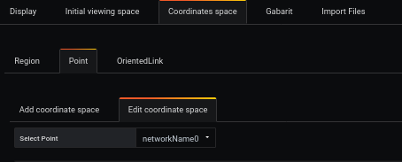
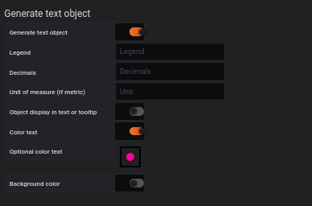

# template simple

[](README.md)


## Ajouter des requêtes

L'exemple montre comment utiliser des filtres de requête pour obtenir des mesures précises


Dans une requête, nous voulons analyser ce que la carte réseau reçoit

Requête refID A

```
node_network_name_assign_type

```

Le résultat montre plusieurs issues possibles

```
node_network_name_assign_type{device="ens3",instance="localhost:9100",job="node_exporter"}

```

et la requête RefID B

```
node_network_flags
```

Le résultat montre plusieurs issues possibles

```
node_network_flags{device="ens3",instance="localhost:9100",job="node_exporter"}
node_network_flags{device="lo",instance="localhost:9100",job="node_exporter"}

```


pour obtenir un chiffre à l'instant, il faut cocher la case **instant** pour chaque query


Pour associer les élements de requête affinée à un gabarit, nous nous interresserons à l'élément :


- device

qui sera utilisé dans le fichier modèle json de la liste **filtered**


## Step 2: Déterminer un espace


La création d'un espace d'arrière-plan se fait à partir du menu 'display'.

Elle nécessite

- Décocher la case `use svg`
- Entrez la largeur (ex : 400)
- Entrez la hauteur (ex : 400)

Il est possible d'avoir plus de détails avec la page [display](../editor/display.md).

## Gabarit

Dans l'onglet **Gabarit**


vous ajoutez le lien du fichier json

```
https://raw.githubusercontent.com/atosorigin/grafana-weathermap-panel/master/docs/resource/demo13-point.json

```

puis 1 clic que le bouton **Add** suivi de **finish**

```
https://raw.githubusercontent.com/atosorigin/grafana-weathermap-panel/master/docs/resource/demo13-poînt-link.json

```

puis 1 clic que le bouton **Add** suivi de **finish**

le lien s'affichera dans la deuxième partie de l'écran


il faut lui attribuer une query pour

- A pour le premier fichier
- B pour le deuxieme fichier

puis 1 clic **load** par ligne


## Partie temporaire (mais actuellement l'opération est nécessaire)




Vous devez vous rendre dans l'onglet **point** de **Coordinate space**



Dans **Text Objet** vous décochez la case la ligne **Object display in text or tooltip**


## Resultat


Vous verrez un point apparaitre et l'ensemble des réglages seront disponible dans l'éditeur


