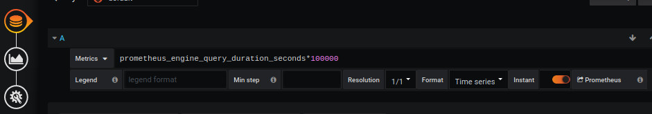
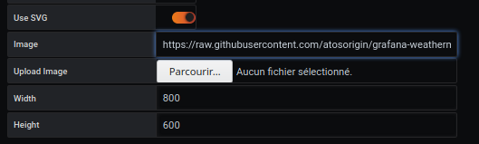
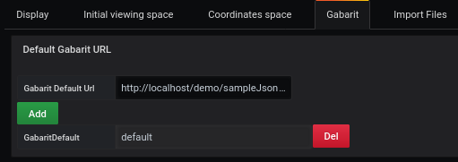
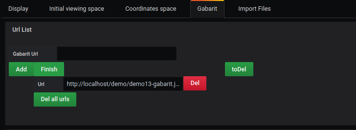
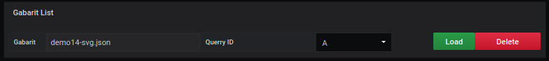
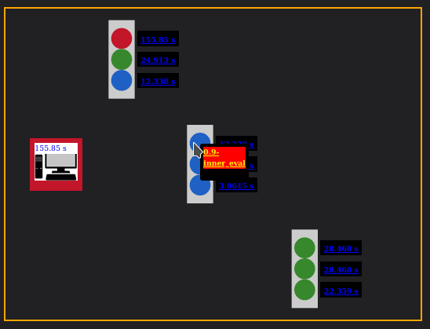

# Gabarit dynamique avancé

[](README.md)

Le fichier SVG est composé de différents éléments d'identification, qui serviront d'ID de région pour le plugin.

La démo 14 affichera la valeur de la même requête dans une requête, avec une couleur variable prédéfinie.

## Add a query

L'exemple montre comment utiliser des filtres de requête pour obtenir des mesures précises



In a query, we want to analyze what the network card receives

```
prometheus_engine_query_duration_seconds*100000
```

Dans une requête, nous voulons analyser ce que la carte réseau reçoit

```
prometheus_engine_query_duration_seconds{instance="localhost:9090",job="prometheus",quantile="0.5",slice="inner_eval"}
prometheus_engine_query_duration_seconds{instance="localhost:9090",job="prometheus",quantile="0.5",slice="prepare_time"}
prometheus_engine_query_duration_seconds{instance="localhost:9090",job="prometheus",quantile="0.5",slice="queue_time"}
prometheus_engine_query_duration_seconds{instance="localhost:9090",job="prometheus",quantile="0.5",slice="result_sort"}
prometheus_engine_query_duration_seconds{instance="localhost:9090",job="prometheus",quantile="0.9",slice="inner_eval"}
prometheus_engine_query_duration_seconds{instance="localhost:9090",job="prometheus",quantile="0.9",slice="prepare_time"}
prometheus_engine_query_duration_seconds{instance="localhost:9090",job="prometheus",quantile="0.9",slice="queue_time"}
prometheus_engine_query_duration_seconds{instance="localhost:9090",job="prometheus",quantile="0.9",slice="result_sort"}
prometheus_engine_query_duration_seconds{instance="localhost:9090",job="prometheus",quantile="0.99",slice="inner_eval"}
prometheus_engine_query_duration_seconds{instance="localhost:9090",job="prometheus",quantile="0.99",slice="prepare_time"}
prometheus_engine_query_duration_seconds{instance="localhost:9090",job="prometheus",quantile="0.99",slice="queue_time"}
prometheus_engine_query_duration_seconds{instance="localhost:9090",job="prometheus",quantile="0.99",slice="result_sort"}

```

Les éléments qui nous intéressent sont :

- instance
- emploi
- quantile
- tranche

qui sera utilisé dans le fichier modèle json de la liste **filtrée**.

## Ajouter une image de fond




L'ajout d'une image de fond se fait à partir du menu `display`.

L'image sélectionnée sera [demo14-background.svg](../../resource/demo14-background.svg).

Pour ce faire, nous la téléchargeons en base64 avec la fonction `Copier l'adresse de l'image`, ou avec le lien direct du dépôt :


```
https://raw.githubusercontent.com/atosorigin/grafana-weathermap-panel/master/docs/resource/demo14-background.svg

```

Il est possible d'avoir plus de détails avec la page [display](../editor/display.md).

## Gabarit avancé

Dans l'onglet **Gabarit**



vous ajoutez le fichier par défaut

```
https://raw.githubusercontent.com/atosorigin/grafana-weathermap-panel/master/docs/resource/demo14-default.json

```

puis 1 clic que le bouton **finish**




vous ajoutez le lien du fichier json

```
https://raw.githubusercontent.com/atosorigin/grafana-weathermap-panel/master/docs/resource/demo14-svg.json

```


puis 1 clic que le bouton **Add** suivi de **finish**.

le lien sera affiché dans la deuxième partie de l'écran




une requête doit lui être attribuée

puis 1 clic **load**

## Résultat



## Structure des fichiers gabarit

le fichier `template` utilisera : 

- Une couleur variable en limite inférieure
- Chaque SVG ID sera déterminé comme une région
- Dans un fond SVG, chaque ID SVG affichera la couleur de la demande selon les limites définies
- Affiche une Meta donnée lorsque vous passez la souris sur une des régions
- Ajout d'une région de coordonnées avec le résultat du filtre d'interrogation


### gabarit par défaut : demo14-default.json

pour le bon fonctionnement de la démo 14, la structure du dossier sera : 


```
{
  "global": {
     // global
  },
  "default": {
    "templates": [
      {
        // Point
      },
      {
        // Link
      },
      {
        // Region
      }
    ]
  }
}

```

### Template gabarit : demo14-svg.json

pour le bon fonctionnement de la démo 14, la structure du dossier sera : 

```
{
  "global": {
    // global
  },
  "default": {
    "templates": [
      {
        // Region
      }
    ]
  },
  "templates": [
      {
        // Region 0
      },
      {
        // Region 1
      },
      {
        // Region 2
      },
      {
        // Region 3
      },
      {
        // Region 4
      },
      {
        // Region 5
      },
      {
        // Region 6
      },
      {
        // Region 7
      },
      {
        // Region 8
      },
      {
        // Coordinate Region
      },
   ]
}

```

# Voir aussi

- [Gabarit default](../appendix/gabarit-default.md)
- [Gabarit template](../appendix/gabarit-template.md)
