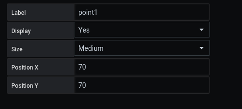
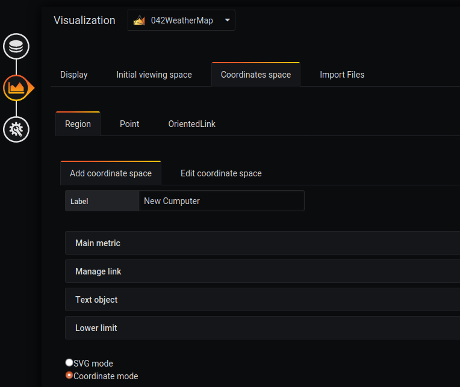

# Créer un dashboard avancé avec des liens directionnels


## Etape 1 : Création des requêtes


La première étape est dans l'onglet "Queries".

Vous devez :
- Compléter la ligne "metrics" avec les lignes suivantes

```
rate(node_network_receive_bytes{device="enp0s3"}[10s])*8/1024/1024

rate(node_network_transmit_bytes{device="enp0s3"}[10s])*8/1024/1024
```

Les marqueurs "A" et "B" seront utilisés pour identifier cette requête, comme vous pouvez le voir ci-dessous.


## Étape 2 : Déterminer un espace


La création d'un background se fait à partir du menu `dIsplay`.

Elle nécessite 

- Décocher la case `use svg`
- Entrez la largeur
- Entrez la hauteur


## Étape 3 : Ajouter un point 




La création d'un point se fait à partir du menu `Coordinates space`, `point` et `Add point`.

Vous devez remplir le formulaire comme ceci : 

- Entrez un `label` par exemple Ordinateur
- La `size`
- position `X`
- position `Y`
- Cliquez sur le bouton `load`


Nous en profitons pour changer la couleur de notre point. Pour ce faire, nous ajoutons une couleur à notre point comme ceci : 

- Activez l'option `trace the color`
- Choisissons la couleur comme `vert` pour la ligne `edit border color`
- Épaisseur à 1 avec `size border`


## Etape 4 : Ajouter une image 


Pour ajouter une illustration à notre region, allez dans le menu `Coordinates space`, `region`et `Add coordinate space`. 
Ensuite, choisissez notre region.



Vous devez remplir le formulaire comme ceci : 

- Entrez un `label`par exemple Ordinateur
- Sélectionnez `Coordinate mode`.
- Choisissez ensuite une image

L'image sélectionnée sera [cumputer-svg.svg](../../resource/computer-svg.svg). Pour ce faire, remplissez l'entrée avec l'adresse du fichier svg

Choisissez ensuite la taille de la région pour votre image. Ici, nous choisissons :
- X Min : -10
- X Max : -50
- Y Min : -10
- Y Max : -50

Pour finir
- Cliquez sur le bouton `load`


## Étape 5 : Définir ses liens orientés incurvés

Pour cette étape, nous allons définir 2 liens orientés incurvés. Le premier, du point à l'image et le second, de l'image au point.

Commençons par créer 2 liens orientés.

Pour créer un lien orienté, vous devez passer par [le menu du panneau](../panel/panel-incurved-link.md).

Ensuite, nous allons éditer nos liens comme suit :


## Etape 6 : Main metric

Pour ajouter une mesure principale à notre lien, allez dans `Coordinates space`, `OrientedLink` et cliquez sur votre lien.

Ensuite, dans `Main metric`, choisissez votre métrique.


## Resultat


### Import JSON file

- It is possible to add all of those configuration through json files by doing an import. To know how to do it, [follow this link](../editor/import.md)

And here is the different JSON file :

- [demo3-region](../../resource/demo3-region.json) 
- [demo3-point](../../resource/demo3-point.json)
- [demo3-link](../../resource/demo3-link.json)

