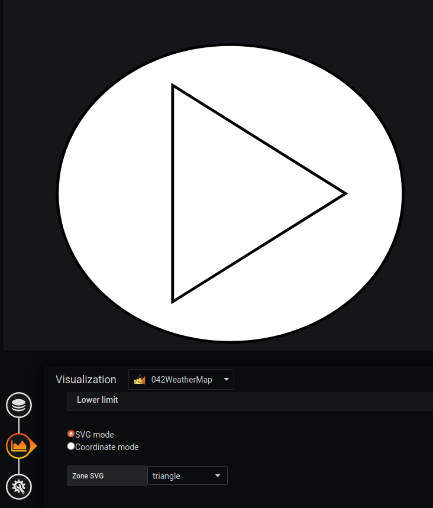

# Comment créer et ajouter votre propre image SVG dans Grafana

 
## Créer votre SVG sur inkscape

### Étape 1 : Télécharger Inkscape

Le logiciel recommandé pour créer une image de fond sera [Inkscape] (https://inkscape.org). Il est disponible pour :

  - Linux
  - Windows
  - Mac

### Étape 2 : Créer votre forme

Inkscape vous permet de choisir entre plusieurs formes pour créer votre SVG :
- Cercle :
- Carré
- Autre..

! [Inkscape](./../../screenshots/demo/tutorial4/Inkscape.png)

Vous pouvez également créer votre image SVG avec draw.io. Plus d'informations [ici](./appendix/svg.md)

### Etape 3 : Ajouter un identifiant à tous vos objets

Il est nécessaire d'ajouter un identifiant à tous vos objets. Il sera plus facile à utiliser avec grafana.

Pour ajouter un identifiant, `right click` sur votre objet, puis allez sur `Properties of your object`. Une fenêtre apparaîtra et vous permettra de modifier l'identifiant

### Étape 4 : Sauvez votre forme

Pour sauvegarder votre forme, vous devez enregistrer au format `SVG Inkscape` ou `SVG simple`.

## Ajoutez votre SVG à Grafana

L'ajout d'une image de fond se fait à partir du menu `display`.

L'image sélectionnée sera celle que vous venez de créer. Pour ce faire, nous la téléchargeons en base64 avec la fonction `Copy image address`.

Il est possible d'avoir plus de détails avec la page [display](../editor/display.md).

Ensuite, si vous voulez ajouter une région, vous pouvez voir les différents id de votre forme dans "Zone SVG". 

